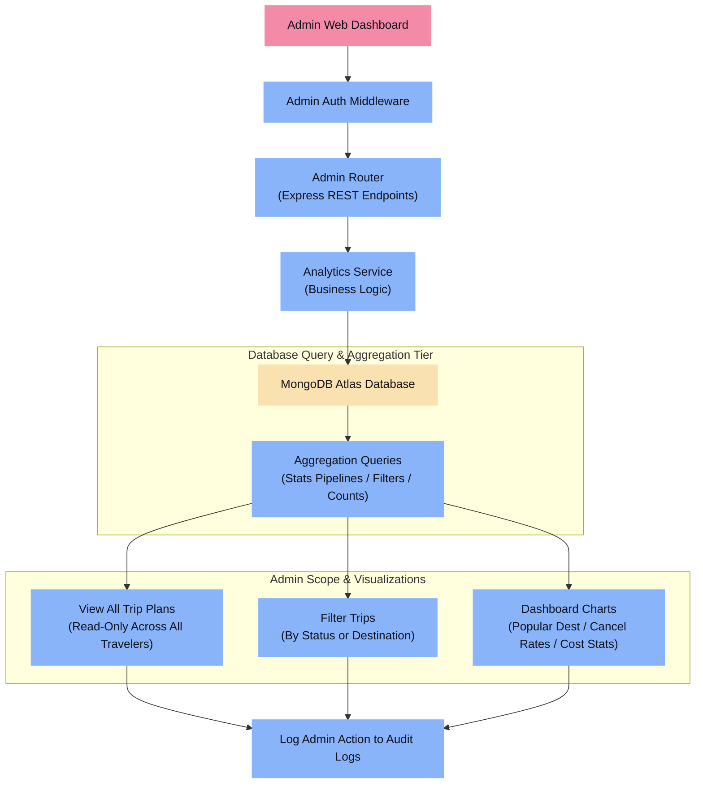
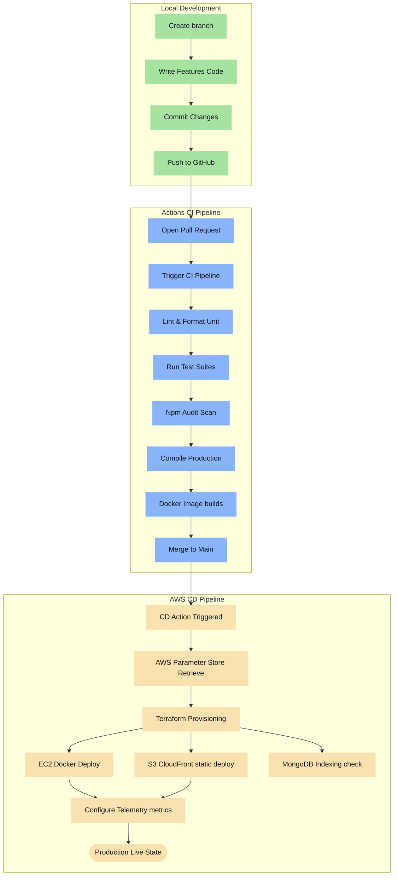
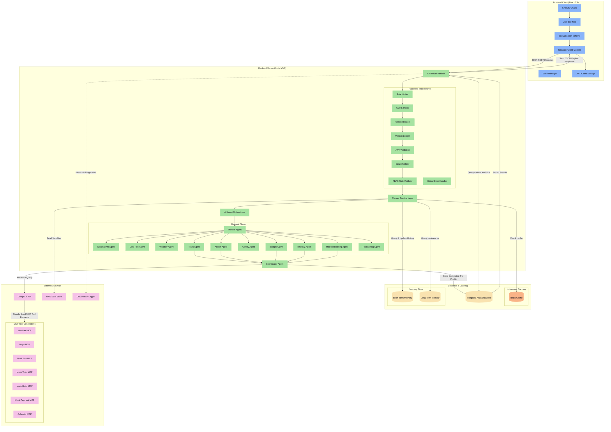
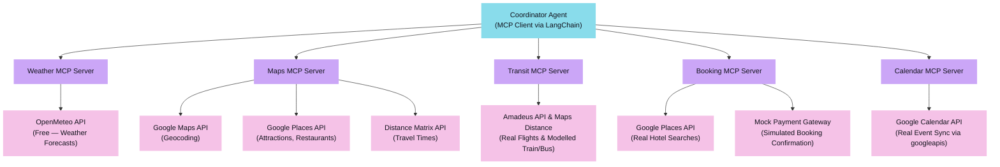
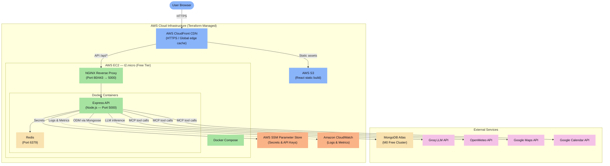
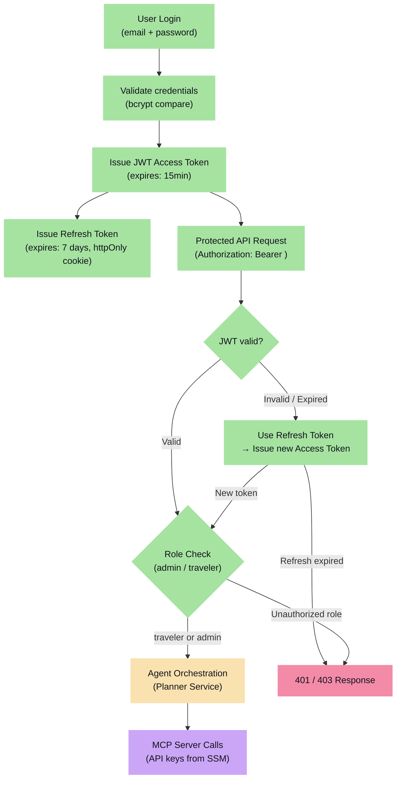
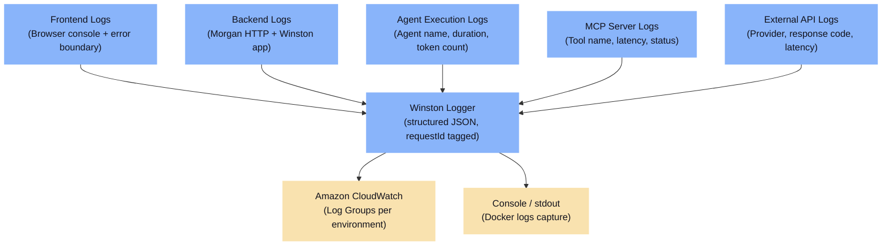

# Travel Planner AI Agent - Capstone Project Documentation

This repository contains the architecture, workflow designs, and system integration details for the Travel Planner AI Client/Server application. The project serves as an enterprise-grade capstone integrating architectural principles and technologies demonstrating a production-ready, multi-agent AI system backed by MCP tool calling, dual-layer memory, Redis caching, and AWS cloud infrastructure.

---

## Table of Contents

1. [Traveler Workflow](#1-traveler-workflow)
2. [Admin Workflow](#2-admin-workflow)
3. [AI Agent Internal Flow](#3-ai-agent-internal-flow)
4. [Project Development Workflow](#4-project-development-workflow)
5. [Complete System Architecture](#5-complete-system-architecture)
6. [MCP Architecture](#6-mcp-architecture-integration-model)
7. [Multi-Agent Workflow — Agent I/O Specification](#7-multi-agent-workflow--agent-io-specification)
8. [Agent Communication & Shared Trip Context](#8-agent-communication--shared-trip-context)
9. [Error Handling & Retry Strategy](#10-error-handling--retry-strategy)
10. [Deployment Architecture](#11-deployment-architecture)
11. [Security Flow](#12-security-flow)
12. [Observability — Logging, Metrics & Health Checks](#13-observability--logging-metrics--health-checks)
13. [Functional Execution Scenarios](#14-functional-execution-scenarios-simulated-outputs)
14. [Tech Stack](#15-tech-stack)

---

## 1. Traveler Workflow

Traces the execution path starting from client-side Zod auth validation, JWT authorization, service orchestration, standardized tool calling, parallel data retrieval, sequential budgeting, human-in-the-loop review, and mock bookings down to persistent storage.

```mermaid
graph TD
    %% Styling and config
    classDef default fill:#1e1e2e,stroke:#cdd6f4,stroke-width:2px,color:#cdd6f4;
    classDef startEnd fill:#a6e3a1,stroke:#a6e3a1,stroke-width:2px,color:#11111b;
    classDef process fill:#89b4fa,stroke:#89b4fa,stroke-width:2px,color:#11111b;
    classDef agent fill:#f9e2af,stroke:#f9e2af,stroke-width:2px,color:#11111b;
    classDef api fill:#f5c2e7,stroke:#f5c2e7,stroke-width:2px,color:#11111b;
    classDef cache fill:#fab387,stroke:#fab387,stroke-width:2px,color:#11111b;
    
    Traveler([Traveler]):::startEnd --> Auth["Auth (Zod + Hook Form)"]:::process
    Auth --> JWTIssue["JWT Issued (RBAC)"]:::process
    JWTIssue --> FetchData["Fetch User Dashboard Data<br/>(TanStack Query Cache)"]:::process
    
    FetchData --> DashboardView{"Select Action"}:::process
    DashboardView -->|Create Trip| BaseGoal["Conversational Chat Input"]:::process
    DashboardView -->|Manage Trips| HistoryGroup["History Groups<br/>(Upcoming / Completed / Cancelled / Drafts)"]:::process
    
    HistoryGroup --> DeleteReq["Delete / Cancel Request"]:::process
    DeleteReq --> ExpressRouter["Express Server Router<br/>(Helmet / CORS / Rate Limiting)"]:::process
    
    BaseGoal --> ExpressRouter
    
    ExpressRouter --> PlannerService["Planner Service<br/>(Business Logic)"]:::process
    PlannerService --> FetchMem["Load Memory<br/>(Short + Long Term)"]:::process
    
    FetchMem --> Planner["Planner Agent / Supervisor<br/>(Dynamic Swarm Supervisor)"]:::agent
    
    Planner --> SupervisorRouter{"Supervisor Tool Selection<br/>(llama3-8b router)"}:::process
    
    SupervisorRouter -->|validate_trip_inputs| CheckMiss["Missing Info Agent"]:::agent
    CheckMiss --> CheckData{"Missing critical info?"}:::process
    
    CheckData -->|Yes| Clarify["Ask Clarifying Question<br/>(Prompt for missing fields)"]:::process
    Clarify --> BaseGoal
    
    CheckData -->|No| Coordinator["Coordinator Agent<br/>(MCP Client Agent)"]:::agent
    
    SupervisorRouter -->|recommend_destination| DestRec["Dest Rec Agent<br/>(Suggest destinations)"]:::agent
    DestRec --> CheckMiss
    
    SupervisorRouter -->|orchestrate_and_generate_trip_plan| Coordinator
    
    %% --- Parallel Agent Execution ---
    subgraph ParallelTasks ["Stage 1: Dynamic LLM-Routed Parallel Agents"]
        %% Weather
        WeatherAgent["Weather Agent<br/>(fetch_weather tool)"]:::agent --> WeatherCacheCheck{"Redis Check"}:::cache
        WeatherCacheCheck -->|Miss| WeatherMCP["Weather MCP Request"]:::api
        WeatherMCP --> WeatherSave["Write to Redis"]:::cache
        WeatherCacheCheck -->|Hit| WeatherOut["Weather Data"]
        WeatherSave --> WeatherOut
        
        %% Transport
        TransAgent["Transport Agent<br/>(fetch_transport tool)"]:::agent --> TransCacheCheck{"Redis Check"}:::cache
        TransCacheCheck -->|Miss| TransMCP["Transit MCP Request"]:::api
        TransMCP --> TransSave["Write to Redis"]:::cache
        TransCacheCheck -->|Hit| TransOut["Transport Data"]
        TransSave --> TransOut
        
        %% Accommodation
        AccomAgent["Accom Agent<br/>(fetch_accommodation tool)"]:::agent --> AccomCacheCheck{"Redis Check"}:::cache
        AccomCacheCheck -->|Miss| AccomMCP["Hotel MCP Request"]:::api
        AccomMCP --> AccomSave["Write to Redis"]:::cache
        AccomCacheCheck -->|Hit| AccomOut["Accommodation Data"]
        AccomSave --> AccomOut
        
        %% Activity
        ActAgent["Activity Agent<br/>(fetch_activities tool)"]:::agent --> ActCacheCheck{"Redis Check"}:::cache
        ActCacheCheck -->|Miss| ActMCP["Places MCP Request"]:::api
        ActMCP --> ActSave["Write to Redis"]:::cache
        ActCacheCheck -->|Hit| ActOut["Activity Data"]
        ActSave --> ActOut
    end
    
    Coordinator -->|fetch_weather| WeatherAgent
    Coordinator -->|fetch_transport| TransAgent
    Coordinator -->|fetch_accommodation| AccomAgent
    Coordinator -->|fetch_activities| ActAgent
    
    WeatherOut --> JoinTasks["Aggregate Parallel Outputs"]:::process
    TransOut --> JoinTasks
    AccomOut --> JoinTasks
    ActOut --> JoinTasks
    
    %% --- Sequential Agent Execution ---
    subgraph SequentialTasks ["Stage 2: Sequential Planning"]
        BudgetAgent["Budget Agent<br/>(Breakdown & Emergency Fund)"]:::agent
        ItinAgent["Itinerary Agent<br/>(Daily schedule details)"]:::agent
    end
    
    JoinTasks --> BudgetAgent
    BudgetAgent --> ItinAgent
    
    ItinAgent --> Summarize["Coordinator Agent<br/>(Synthesize markdown plan)"]:::agent
    
    Summarize --> SavePlanned["Save Trip to MongoDB Atlas<br/>(Status: Planned - Awaiting Payment)"]:::process
    
    SavePlanned --> HITL{"Human-in-the-Loop Confirmation"}:::process
    
    HITL -->|Reject| ModifyReq["Modify via Replanning Agent"]:::agent
    ModifyReq --> PreserData["Preserve Context<br/>(Keep destination, weather, transport, prefs)"]:::process
    PreserData --> UpdateReq["Update requested changes only<br/>(Edit accommodation, budget, or itinerary)"]:::process
    UpdateReq --> Coordinator
    
    HITL -->|Approve| BookingSystem["Mocked Booking Agent<br/>(Mock reservations & payments)"]:::agent
    
    BookingSystem --> SaveDB["Save Trip to MongoDB Atlas<br/>(Status: Confirmed - Paid)"]:::process
    
    SaveDB --> Notifications["Dispatch Notifications<br/>(Calendar Sync / Email / Push Alerts)"]:::process
    
    Notifications --> UpdateStatus["Update Trip Status Enums<br/>(Draft ➔ Planned ➔ Confirmed)"]:::process
    UpdateStatus --> DashboardUpdate([Dashboard Updated]):::startEnd
```



---

## 2. Admin Workflow

Details admin authorization, role validation middleware, navigation to administrative management sections, and metrics visualization dashboards. Admin features fetch directly from database indexes without hitting AI interface layers.



---

## 3. AI Agent Internal Flow

Highlights sequential planning execution and conditional routing (handling ambiguity, budget checks, confidence failures, MCP tool calling, and human validation) to complete traveler goals.

```mermaid
graph TD
    classDef default fill:#1e1e2e,stroke:#cdd6f4,stroke-width:2px,color:#cdd6f4;
    classDef startEnd fill:#a6e3a1,stroke:#a6e3a1,stroke-width:2px,color:#11111b;
    classDef process fill:#89b4fa,stroke:#89b4fa,stroke-width:2px,color:#11111b;
    classDef agent fill:#f9e2af,stroke:#f9e2af,stroke-width:2px,color:#11111b;
    classDef tool fill:#f5c2e7,stroke:#f5c2e7,stroke-width:2px,color:#11111b;
    classDef error fill:#f38ba8,stroke:#f38ba8,stroke-width:2px,color:#11111b;
    classDef cache fill:#fab387,stroke:#fab387,stroke-width:2px,color:#11111b;

    Goal([User Goal]):::startEnd --> Controller["Trip Controller"]:::process
    Controller --> PlannerService["Planner Service"]:::process
    
    %% Turn State Memory (Dual-Layer)
    PlannerService --> FetchMem["Load Memories"]:::process
    
    FetchMem --> Planner["Planner Agent / Supervisor"]:::agent
    
    %% Supervisor Dynamic routing via tool selection
    Planner --> RoutingDecision{"Supervisor Tool Caller"}:::process
    
    RoutingDecision -->|validate_trip_inputs| CheckData["Missing Info Agent"]:::agent
    CheckData --> CheckDest{"Missing info?"}:::process
    
    CheckDest -->|Yes| Clarify["Prompt Missing Fields"]:::process
    Clarify --> Goal
    CheckDest -->|No (Complete)| Coord["Coordinator Agent"]:::agent
    
    RoutingDecision -->|recommend_destination| DestAgent["Destination Rec Agent"]:::agent
    DestAgent --> CheckData
    
    RoutingDecision -->|orchestrate_and_generate_trip_plan| Coord["Coordinator Agent"]:::agent
    
    %% Hybrid Parallel / Sequential Stage
    subgraph ParallelPhase ["Parallel Gathering Phase"]
        %% Weather
        WeatherAgent["Weather Agent"]:::agent --> WeatherCache{"Redis Check"}:::cache
        WeatherCache -->|Miss| WeatherMCP["Weather MCP"]:::tool
        WeatherMCP --> WeatherWrite["Write to Redis"]:::cache
        WeatherCache -->|Hit| WeatherJoin["Weather Data"]
        WeatherWrite --> WeatherJoin
        
        %% Transport
        TransAgent["Transport Agent"]:::agent --> TransCache{"Redis Check"}:::cache
        TransCache -->|Miss| SchedulesMCP["Transit MCP"]:::tool
        SchedulesMCP --> TransWrite["Write to Redis"]:::cache
        TransCache -->|Hit| TransJoin["Transport Data"]
        TransWrite --> TransJoin
        
        %% Accommodation
        AccomAgent["Accommodation Agent"]:::agent --> AccomCache{"Redis Check"}:::cache
        AccomCache -->|Miss| HotelMCP["Hotel MCP"]:::tool
        HotelMCP --> AccomWrite["Write to Redis"]:::cache
        AccomCache -->|Hit| AccomJoin["Accommodation Data"]
        AccomWrite --> AccomJoin
        
        %% Activity
        ActAgent["Activity Agent"]:::agent --> ActCache{"Redis Check"}:::cache
        ActCache -->|Miss| MapsMCP["Maps MCP"]:::tool
        MapsMCP --> ActWrite["Write to Redis"]:::cache
        ActCache -->|Hit| ActJoin["Activity Data"]
        ActWrite --> ActJoin
    end
    
    Coord --> WeatherAgent
    Coord --> TransAgent
    Coord --> AccomAgent
    Coord --> ActAgent
    
    WeatherJoin --> JoinGather["Join Gathered Data"]:::process
    TransJoin --> JoinGather
    AccomJoin --> JoinGather
    ActJoin --> JoinGather
    
    subgraph SequentialPhase ["Sequential Planning Phase"]
        BudgetAgent["Budget Agent"]:::agent
        CheckBudget{"Is budget impossible?"}:::process
        AltBudget["Propose Alternatives"]:::error
        
        ItinAgent["Itinerary Agent"]:::agent
    end
    
    JoinGather --> BudgetAgent
    BudgetAgent --> CheckBudget
    CheckBudget -->|Yes| AltBudget
    AltBudget --> Goal
    CheckBudget -->|No| ItinAgent
    
    %% Confidence Checks
    ItinAgent --> ConfidenceCheck{"Do parameters validate?"}:::process
    ConfidenceCheck -->|No| ErrorHandle["Error Fallback"]:::error
    ErrorHandle --> EndGrace([Graceful Terminate]):::startEnd
    
    ConfidenceCheck -->|Yes| Comp["Coordinator Agent"]:::agent
    Comp --> LLMFormat["Format via Groq LLM"]:::process
    
    LLMFormat --> SavePlannedDB["Save Trip to DB<br/>(Status: Planned - Awaiting Payment)"]:::process
    SavePlannedDB --> SaveMem["Save Memory States"]:::process
    
    SaveMem --> TravelerReview["User Review Plan"]:::process
    
    TravelerReview --> Approve{"Is plan approved?"}:::process
    Approve -->|No| ReplanningAgent["Replanning Agent<br/>(Context Preservation)"]:::agent
    ReplanningAgent --> PrefsKeep["Preserve Context<br/>(destination, weather, transport, prefs)"]:::process
    PrefsKeep --> UpdateOnly["Update only requested changes"]:::process
    UpdateOnly --> Coord
    
    %% Mocked Booking Layer details
    Approve -->|Yes| BookingAgent["Mocked Booking Agent"]:::agent
    BookingAgent --> ConfirmDB["Save Booked Trip<br/>(Status: Confirmed - Paid)"]:::process
    
    ConfirmDB --> EndApp([End Workflow]):::startEnd
```

### Supervisor Delegation & Dynamic Tool Orchestration Model
In this architecture, rather than checking logic via a hardcoded controller script, the **Planner Agent** functions as the central **Supervisor Agent** that binds child agents as schema-level **LangChain Tools** to direct conversational execution:
- **`validate_trip_inputs`**: Dynamically called if any slot (destination, dates, travelers, budget) is missing. Delegates execution to the `MissingInfoAgent` to capture conversation parameters.
- **`recommend_destination`**: Dynamically called when no destination is provided to run the `DestinationRecAgent` for options.
- **`orchestrate_and_generate_trip_plan`**: Dynamically called when parameters are fully complete to execute the trip generation swarm.

Once the planning step is active, the orchestrator delegates parallel data collection. The **Coordinator Agent** executes an **LLM tool router** which binds the actual tool schemas of the parallel swarm. The LLM decides exactly which MCP tools (`fetch_weather`, `fetch_transport`, `fetch_accommodation`, `fetch_activities`) need to be invoked based on the traveler's inputs. This dynamic routing reduces external API costs and optimizes round-trip times by only executing modified parameters.

---

## 4. Project Development Workflow

Illustrates the Git workflow, Continuous Integration pipeline via GitHub Actions, Docker builds, Terraform IaC provisioning, and deployment endpoints on AWS.



---

## 5. Complete System Architecture

Maps out the structural tier boundaries: Frontend Web Client, Service Layer context, AI Agent orchestration cluster, External MCP Integrations, and persistent database/caching layers.



---

## 6. MCP Architecture — Integration Model

The **Model Context Protocol (MCP)** is the standardized interface layer that decouples AI Agents from raw external APIs. Instead of agents calling APIs directly, every agent communicates through a typed MCP Server, which handles authentication, rate limiting, response normalization, and caching hand-off. This makes agents portable and testable — swapping a real API for a mock requires no agent code change.

### How MCP Works in This System

```
AI Agent  →  LangChain Tool Call  →  MCP Server  →  External API
```

Each MCP server acts as a **typed, schema-validated adapter** for one external service domain. The Coordinator Agent delegates tool calls via LangChain's MCP client, which routes requests to the correct MCP server instance.

### MCP Server Map



### MCP Tool Schema (Example — Weather MCP)

Each MCP tool exposes a strictly typed JSON schema so the LLM can call it deterministically:

```json
{
  "name": "get_weather_forecast",
  "description": "Returns a multi-day weather forecast for a given destination and date range.",
  "inputSchema": {
    "type": "object",
    "properties": {
      "destination": { "type": "string", "description": "City or region name" },
      "start_date":  { "type": "string", "format": "date", "description": "YYYY-MM-DD" },
      "end_date":    { "type": "string", "format": "date", "description": "YYYY-MM-DD" }
    },
    "required": ["destination", "start_date", "end_date"]
  },
  "outputSchema": {
    "type": "object",
    "properties": {
      "forecast": {
        "type": "array",
        "items": {
          "date":        { "type": "string" },
          "condition":   { "type": "string" },
          "temp_high_c": { "type": "number" },
          "temp_low_c":  { "type": "number" },
          "rain_mm":     { "type": "number" }
        }
      }
    }
  }
}
```

### Which APIs Are Wrapped vs. Called Directly

| Integration | How Accessed | MCP Server |
|:---|:---|:---|
| OpenMeteo Weather | Via MCP | `weather-mcp-server` |
| Google Maps Geocoding | Via MCP | `maps-mcp-server` |
| Google Places (Attractions) | Via MCP | `maps-mcp-server` |
| Distance Matrix | Via MCP | `maps-mcp-server` |
| Amadeus Flights / Maps Rail | Via MCP | `transit-mcp-server` |
| Google Places (Lodging) | Via MCP | `booking-mcp-server` |
| Google Calendar | Via MCP | `calendar-mcp-server` |
| Groq LLM API | Direct (LangChain) | — |
| MongoDB Atlas | Direct (Mongoose) | — |
| Redis | Direct (ioredis) | — |

---

## 7. Multi-Agent Workflow — Agent I/O Specification

This section answers: **Who triggers what? What does each agent receive? What does it return? When is the workflow complete?**

### Workflow Trigger

The workflow is **initiated by the Traveler** via the React chat interface. The HTTP request hits the Express server, passes through the middleware chain, and enters the `Planner Service` which bootstraps the `Coordinator Agent` as the central orchestrator.

### Stage 0 — Pre-Planning (Sequential)

```
User Input → Planner Agent → Missing Info Agent → Destination Rec Agent
```

| Agent | Input | Processing | Output |
|:---|:---|:---|:---|
| **Planner Agent** | Raw user message, conversation history, long-term memory | Parses intent, extracts slots (destination, dates, budget, travelers, interests) | Populated `TripContext` object with inferred / extracted fields |
| **Missing Info Agent** | `TripContext` with potentially empty slots | Checks for critical missing fields: destination, dates, approximate budget | Either `{ complete: true }` or `{ missingFields: ["budget", "dates"] }` with clarifying question |
| **Destination Rec Agent** *(if no destination)* | Traveler's interests, budget range, historical preferences from long-term memory | Scores destinations using budget + weather + preference matching | `{ recommendedDestinations: [...], reasoning: "..." }` |

### Stage 1 — Parallel Data Retrieval (Concurrent)

The Coordinator Agent dispatches all five agents **simultaneously** using `Promise.allSettled()`. Each agent queries its MCP server independently.

| Agent | Input | MCP Server Called | Output |
|:---|:---|:---|:---|
| **Weather Agent** | `{ destination, start_date, end_date }` | `weather-mcp-server → OpenMeteo` | `{ forecast: [...dailyConditions] }` |
| **Transport Agent** | `{ origin, destination, travel_dates }` | `transit-mcp-server → Mock Rail/Bus` | `{ options: [...trainBusOptions], estimated_cost_inr }` |
| **Accommodation Agent** | `{ destination, check_in, check_out, travelers }` | `booking-mcp-server → Mock Hotel` | `{ hotels: [...], recommended, price_per_night }` |
| **Activity Agent** | `{ destination, interests, days }` | `maps-mcp-server → Google Places` | `{ attractions: [...], restaurants: [...], timings, entry_fees }` |
| **Local Transport Agent** | `{ destination, hotel_location }` | `maps-mcp-server → Distance Matrix` | `{ cab_estimates: [...], auto_estimates: [...] }` |

### Stage 2 — Sequential Planning (Ordered)

After parallel results are aggregated into the shared `TripContext`, the sequential phase begins:

| Agent | Input | Processing | Output |
|:---|:---|:---|:---|
| **Budget Agent** | All cost estimates from Stage 1 + `traveler_budget` | Sums categories, adds 10% emergency buffer, validates against budget ceiling | `{ breakdown: {...}, total_cost, remaining_budget, is_feasible }` |
| **Itinerary Agent** | `TripContext` with weather + activities + accommodation + budget | Generates day-by-day schedule respecting weather advisories, check-in times, spending caps | `{ itinerary: [...dailySchedule], notes }` |
| **Coordinator Agent** | Full `TripContext` after all agents complete | Synthesizes into a human-readable Markdown trip plan using Groq LLM | Final formatted trip plan for HITL review |

### Stage 3 — Human-in-the-Loop & Booking (Sequential)

| Agent | Trigger | Input | Output |
|:---|:---|:---|:---|
| **Replanning Agent** | User rejects plan | Rejection reason + original `TripContext` | Preserves existing context (destination, weather, transport), updates only modified slots, and hands back to Coordinator to re-plan |
| **Booking Agent** | User approves plan | Final approved `TripContext` | `{ booking_refs: {...}, status: "CONFIRMED" }` |
| **Calendar Agent** | Post-booking | Trip dates + user email | Google Calendar events created, confirmation sent |

### Workflow Termination Conditions

| Condition | Result |
|:---|:---|
| Plan approved + booked successfully | ✅ Trip saved to MongoDB with status `CONFIRMED` (Paid) |
| Itinerary generated (pre-booking) | 📋 Trip saved to MongoDB with status `PLANNED` (Awaiting Payment) |
| Budget infeasible after 3 alternatives | ⚠️ Returns alternatives, awaits user budget update |
| Itinerary confidence check fails | ❌ Graceful error response, session preserved |
| User cancels mid-flow | Trip saved as `DRAFT` status |

---

## 8. Agent Communication & Shared Trip Context

### How Agents Communicate

Agents do **not** call each other directly via REST or message queues. Instead, they all read from and write to a **single shared `TripContext` object** managed by the `Planner Service`. This is a synchronous, in-memory coordination pattern — the Coordinator Agent passes snapshots of this context to each agent and merges the results back.

```
Planner Service
      │
      ▼
TripContext (shared state)
      │
      ├── Coordinator Agent reads → dispatches to parallel agents
      │       ├── Weather Agent → writes forecast to TripContext
      │       ├── Transport Agent → writes options to TripContext
      │       ├── Accommodation Agent → writes hotels to TripContext
      │       ├── Activity Agent → writes attractions to TripContext
      │       └── Local Transport Agent → writes transfer estimates to TripContext
      │
      ├── Budget Agent reads TripContext → writes cost breakdown
      ├── Itinerary Agent reads TripContext → writes daily schedule
      └── Coordinator Agent reads TripContext → generates final plan
```

### TripContext Schema

Every agent receives and returns data conforming to this shared context object. Each agent updates only its own slice:

```json
{
  "sessionId": "uuid-v4",
  "userId": "mongo-object-id",
  "status": "DRAFT | PLANNED | CONFIRMED",
  "input": {
    "destination": "Ooty, Tamil Nadu",
    "origin": "Chennai",
    "start_date": "2025-10-15",
    "end_date": "2025-10-20",
    "travelers": 2,
    "budget_inr": 30000,
    "interests": ["nature", "hiking", "local food"]
  },
  "weather": {
    "forecast": [
      { "date": "2025-10-15", "condition": "Partly Cloudy", "temp_high_c": 18, "rain_mm": 2 }
    ]
  },
  "transport": {
    "options": [
      { "mode": "Train", "operator": "Indian Railways", "duration_hrs": 10, "cost_inr": 1800 }
    ]
  },
  "accommodation": {
    "recommended": "Ooty Vista Inn",
    "price_per_night_inr": 2125,
    "total_cost_inr": 8500
  },
  "activities": {
    "attractions": ["Botanical Garden", "Ooty Tea Factory", "Doddabetta Peak"],
    "restaurants": ["Garden View Cafe", "Mountain Retreat Dining"],
    "total_entry_fees_inr": 3500
  },
  "local_transport": {
    "cab_estimates_inr": 2500
  },
  "budget": {
    "breakdown": {
      "transport": 1800,
      "accommodation": 8500,
      "food": 4000,
      "activities": 3500,
      "local_transport": 2500,
      "emergency_fund": 2030
    },
    "total_cost_inr": 22330,
    "remaining_budget_inr": 7670,
    "is_feasible": true
  },
  "itinerary": {
    "days": [ "...day objects..." ]
  },
  "booking": {
    "refs": {},
    "confirmed_at": null
  },
  "memory": {
    "short_term": [ "...conversation turns..." ],
    "long_term_summary": "User prefers nature trips under ₹35,000."
  }
}
```

---


## 10. Error Handling & Retry Strategy

Real systems fail. This section defines what happens when each component in the system encounters an error.

### Error Handling Matrix

| Component | Error Scenario | Action | User Impact |
|:---|:---|:---|:---|
| **Weather MCP** | OpenMeteo timeout / rate limit | Retry with exponential backoff (3 attempts), then return cached forecast if available | Transparent — uses stale-while-revalidate |
| **Maps MCP** | Google Maps API quota exceeded | Return cached `Distance Matrix` results from Redis; flag in response | Minor delay, cached distances used |
| **Groq LLM** | Invalid JSON in LLM response | Re-prompt with stricter JSON-only system instruction (max 2 retries) | Slight latency |
| **Groq LLM** | Rate limit / timeout | Wait 5s, retry once; if fails, return partial plan with advisory message | User sees partial plan |
| **MongoDB Atlas** | Connection error / timeout | Return `503 Service Unavailable`; Winston error log emitted | Request fails gracefully with user message |
| **Redis** | Connection refused / OOM | Bypass cache, query MCP directly; log warning | Slower response, no user-facing error |
| **Budget Agent** | Budget ceiling exceeded | Do not crash — return 3 alternative budget scenarios for user selection | User prompted to adjust budget |
| **Google Calendar MCP** | OAuth token expired | Trigger token refresh flow; if still fails, booking proceeds without calendar sync | Advisory notification to user |
| **Missing Info Agent** | User provides ambiguous destination | Prompt with top-3 destination suggestions for clarification | Guided clarification dialog |
| **JWT Middleware** | Expired access token | Return `401 Unauthorized`; client uses refresh token to obtain new access token | Seamless re-auth for user |
| **Rate Limiter** | IP exceeds threshold (100 req/15min) | Return `429 Too Many Requests` | Clear rate-limit message with retry-after header |

### Retry Policy — Exponential Backoff

All MCP server calls use a centralized retry utility with the following policy:

```
Attempt 1  ──►  Immediate
      │
      ▼ (fail)
   Wait 2s
      │
      ▼
Attempt 2  ──►  2 seconds after failure
      │
      ▼ (fail)
   Wait 4s
      │
      ▼
Attempt 3  ──►  4 seconds after failure
      │
      ▼ (fail)
Fallback Response  ──►  Cached data OR graceful error message
```

```
Config:
  maxRetries:     3
  baseDelay:      2000ms
  backoffFactor:  2x (exponential)
  timeout:        8000ms per attempt
  jitter:         ±500ms (prevents thundering herd)
```

### Circuit Breaker Pattern (Future Enhancement)

For production hardening, a circuit breaker wraps each MCP server:

```
CLOSED (normal) → OPEN (after 5 failures in 60s) → HALF-OPEN (probe after 30s) → CLOSED
```

When the circuit is **OPEN**, requests to that MCP server immediately return a fallback response without attempting the network call.

---

## 11. Deployment Architecture

### Infrastructure Overview



### Docker Compose Configuration

The backend and Redis run as co-located Docker containers on a single EC2 instance, managed by Docker Compose:

```yaml
# docker-compose.yml (production)
services:
  api:
    image: travel-planner-api:latest
    ports:
      - "5000:5000"
    environment:
      - NODE_ENV=production
      - MONGO_URI=${MONGO_URI}
      - REDIS_URL=redis://redis:6379
      - GROQ_API_KEY=${GROQ_API_KEY}
    depends_on:
      - redis
    restart: unless-stopped

  redis:
    image: redis:7-alpine
    ports:
      - "6379:6379"
    restart: unless-stopped
    command: redis-server --maxmemory 128mb --maxmemory-policy allkeys-lru
```

### Terraform Provisioned Resources

| Resource | Purpose | Free Tier |
|:---|:---|:---|
| `aws_instance` (t2.micro) | EC2 host for Express API + Redis | ✅ 750 hrs/month |
| `aws_s3_bucket` | React production build hosting | ✅ 5GB |
| `aws_cloudfront_distribution` | Global CDN + HTTPS termination | ✅ 1TB outbound |
| `aws_security_group` | Port rules (80, 443, 5000, 22) | ✅ Free |
| `aws_ssm_parameter` | Encrypted secrets storage | ✅ Up to 10,000 |
| `aws_cloudwatch_log_group` | Centralized log retention | ✅ 5GB/month |

---

## 12. Security Flow

### Authentication & Authorization



### Security Controls Summary

| Layer | Control | Implementation |
|:---|:---|:---|
| **Transport** | HTTPS everywhere | CloudFront → NGINX TLS termination |
| **Headers** | Security headers | `helmet()` — XSS, CSP, HSTS, no-sniff |
| **CORS** | Origin allowlist | Express `cors({ origin: [allowedDomains] })` |
| **Rate Limiting** | Throttle abuse | `express-rate-limit` — 100 req / 15 min per IP |
| **Authentication** | Short-lived tokens | JWT access (15m) + httpOnly refresh cookie (7d) |
| **Authorization** | Role-based access | RBAC middleware — `admin` / `traveler` roles |
| **Input Validation** | Sanitize all inputs | `express-validator` on all route parameters |
| **Password Security** | Secure hashing | `bcrypt` with salt rounds = 12 |
| **Secret Management** | No hardcoded keys | AWS SSM Parameter Store (SecureString type) |
| **Environment Variables** | Runtime injection | Docker environment variables from SSM at deploy time |
| **Dependency Audit** | Vulnerability scans | `npm audit` in GitHub Actions CI pipeline |

---

## 13. Observability — Logging, Metrics & Health Checks

### Logging Architecture

Production systems need visibility. Every layer emits structured logs with a shared `requestId` for correlation across the entire request lifecycle.



### What Is Logged

| Event | Logger | Log Level | Key Fields |
|:---|:---|:---|:---|
| HTTP Request In | Morgan | `info` | method, path, status, responseTime, ip |
| HTTP Request Error | Morgan + Winston | `error` | status, error message, requestId |
| Agent Start | Winston | `info` | agentName, sessionId, requestId |
| Agent Complete | Winston | `info` | agentName, durationMs, tokensUsed |
| Agent Error | Winston | `error` | agentName, error, stack |
| MCP Tool Call | Winston | `debug` | toolName, inputParams, latencyMs |
| MCP Tool Error | Winston | `warn` | toolName, error, retryAttempt |
| Cache Hit | Winston | `debug` | cacheKey, ttlRemaining |
| Cache Miss | Winston | `debug` | cacheKey |
| DB Query | Mongoose | `debug` | collection, operation, durationMs |
| Auth Success | Winston | `info` | userId, role, ip |
| Auth Failure | Winston | `warn` | reason, ip, requestId |

### Request ID Correlation

Every incoming request is assigned a `requestId` (UUID v4) by the first middleware. This ID propagates through:

```
HTTP Request  →  requestId: "abc-123"
      │
      ├── Planner Service logs:  { requestId: "abc-123", agentName: "WeatherAgent" }
      ├── MCP Server logs:       { requestId: "abc-123", tool: "get_weather" }
      └── DB Operation logs:     { requestId: "abc-123", collection: "trips" }
```

This allows full request tracing in CloudWatch using a single `requestId` filter.

### Health Check Endpoints

| Endpoint | Method | Returns | Purpose |
|:---|:---|:---|:---|
| `/health` | GET | `{ status: "ok" }` | Load balancer liveness probe |
| `/health/db` | GET | `{ mongo: "ok" / "error" }` | MongoDB connection status |
| `/health/cache` | GET | `{ redis: "ok" / "error" }` | Redis connection status |
| `/health/llm` | GET | `{ groq: "ok" / "error" }` | LLM API reachability |

### Key Metrics Tracked (CloudWatch)

| Metric | What It Tells You |
|:---|:---|
| `api.request.duration` | p50/p95/p99 API latency |
| `agent.execution.duration` | How long each agent takes |
| `mcp.tool.latency` | External API response times |
| `redis.hit_rate` | Cache effectiveness |
| `llm.token_usage` | Groq API cost monitoring |
| `auth.failure_count` | Potential brute force detection |
| `system.error_rate` | Overall system health |

### Future Observability Enhancements

| Tool | Purpose |
|:---|:---|
| **Prometheus** | Pull-based metrics scraping from `/metrics` endpoint |
| **Grafana** | Real-time dashboards for agent latency, error rates, throughput |
| **OpenTelemetry** | Distributed tracing across agents and MCP servers |
| **Sentry** | Frontend + backend error tracking with stack traces |

---

## 14. Functional Execution Scenarios (Simulated Outputs)

To demonstrate how the senior architect design performs in practice, the following sections show simulated responses produced by the Agent cluster.

### A. Itinerary Agent Output
The Itinerary Agent schedules day-by-day routines structured by timeframe. It factors in checking schedules, travel delays, weather advisories (redirecting to indoor attractions if rain alerts prompt), and daily spend caps.

```markdown
# 5-Day Vacation in Ooty (Traveler Count: 2)
### Status: Draft | Month: October | Weather Note: Moderate Clear Skies

## Day 1: Chennai to Ooty Transition & Arrival
* **08:00 AM - 11:30 AM | Travel Time (Transit)**
  * Transit: Rail departure from Chennai Central to Ooty foothills (Mettupalayam).
  * Estimated Cost: ₹1,200 (2 Tickets, Sleeper Option Alternative)
* **11:30 AM - 12:00 PM | Hotel Check-in**
  * Activity: Check-in at Ooty Vista Inn.
  * Travel Time: 20 mins cab transfer from terminal station.
* **12:00 PM - 01:30 PM | Dining (Lunch suggestion)**
  * Restaurant: Garden View Cafe (Local experiences, veg focus).
  * Opening Hours: 11:00 AM - 10:00 PM | Estimated Cost: ₹600
* **01:30 PM - 03:00 PM | Relaxation & Unpacking**
  * Accommodation Note: Hotel amenities tour.
* **03:00 PM - 05:30 PM | Afternoon Sightseeing**
  * Destination: Government Botanical Garden.
  * Timings: 07:00 AM - 06:30 PM | Entry Fee: ₹100 for 2 adults.
  * Weather Consideration: Clear Skies, open air activity highly recommended.
* **05:30 PM - 07:30 PM | Evening Activity**
  * Destination: Ooty Tea Factory & Museum.
  * Timings: 09:00 AM - 07:00 PM | Ticket Cost: ₹50
* **08:00 PM - 09:30 PM | Dinner**
  * Restaurant: Mountain Retreat Dining.
  * Estimated Cost: ₹800
* **Day 1 Total Estimated Cost**: ₹2,750 (Excluding hotel block room reservation)
```

### B. Budget Agent Expense Report
The Budget Agent analyzes all estimated costs compiled by the parallel agents and outputs a strict audit report including an emergency buffer.

| Expense Category | Item Details | Estimated Cost |
|:---|:---|:---:|
| **Transport** | Transit train fares (Coimbatore/Mettupalayam rail connection) | ₹1,800 |
| **Hotel** | 4 Nights at Ooty Vista Inn (Stays class accommodation) | ₹8,500 |
| **Food / Dining** | Meal allowances, breakfast packages, local recommendations | ₹4,000 |
| **Activities** | Entry tickets, botanical gardens, tea estate slots | ₹3,500 |
| **Local Transport** | Station transfer cabs, local auto charges | ₹2,500 |
| **Emergency Fund** | 10% Reserve Buffer calculated for local disruptions | ₹2,030 |
| **Grand Total** | Summary of all categories including emergency fund | **₹22,330** |
| **Remaining Budget** | Safety variance (based on base limit of ₹30,000) | **₹7,670** |

---

## 15. Tech Stack

| Layer | Technology | Purpose | Free Tier Status |
|:------|:-----------|:--------|:-----------------|
| **Frontend** | React (TypeScript) | Single Page Application UI | 100% Free |
| | Vite | Dev server & production bundler | 100% Free |
| | Tailwind CSS | Utility-first styling framework | 100% Free |
| | React Hook Form + Zod | Authentication forms state & validation schema | 100% Free |
| | TanStack Query | Query caching, pagination & dashboard HTTP states | 100% Free |
| | Zustand / Context API | Client-side stores & local session state | 100% Free |
| | Chart.js | Admin analytical statistics visualizer | 100% Free |
| | Axios | REST HTTP Requests Client | 100% Free |
| **Backend** | Node.js + Express.js | REST API server (MVC code structure) | 100% Free |
| | Mongoose | MongoDB ODM schema rules & index tracking | 100% Free |
| | JSON Web Token (JWT) | Authentication & security roles | 100% Free |
| | bcrypt | Password hashing security controls | 100% Free |
| | express-rate-limit | API endpoint rate throttling | 100% Free |
| | Helmet | Express header validation security | 100% Free |
| | CORS | Domain access policy configurations | 100% Free |
| | Morgan / Winston | Request tracing & server diagnostic records | 100% Free |
| **AI / Agents** | Groq LLM API | AI Inference operations (Llama 3 execution model) | 100% Free Developer Tier |
| | LangChain JS | AI Agent chain orchestration framework | 100% Free |
| | Model Context Protocol (MCP) | Interface structure standard for tool integrations | 100% Free |
| **Database & Caching** | MongoDB Atlas | Primary database (Indexed scopes, users & trips) | Shared M0 Cluster — 100% Free |
| | Redis | In-memory API query caching (weather data, schedules) | 100% Free (Self-hosted on EC2 or Redis Cloud Free) |
| **DevOps & Infra** | GitHub Actions | Automatically triggers CI/CD build scripts | 2,000 build minutes/month Free |
| | Docker | System container orchestration packaging | 100% Free Community Tier |
| | Terraform | Automated infrastructure scripts (VPC/EC2/S3 config) | 100% Free CLI |
| | AWS EC2 | Server deployment platform host environment | 12-Month Free Tier (750 hours/month) |
| | AWS S3 + CloudFront | Static client file host and low latency CDN distribution | 12-Month Free Tier (5GB / 1TB Outbound) |
| | AWS SSM Parameter Store | Secure application parameter configuration storage | Always Free Tier (Up to 10,000 Parameters) |
| | Amazon CloudWatch | System alarms monitoring, health, & logging records | Standard Free Tier metrics |
| **External APIs** | OpenMeteo API | Weather forecast readings | 100% Free for Non-Commercial |
| | Google Maps API | Location geocoding & mapping coordinates | $200 Monthly Free Credit Bundle |
| | Google Calendar API | Event reminder synchronization updates | 100% Free Developer API |
| | Booking MCP Tool Engines | Mock Bus, Train, Hotel, and Payment integrations | 100% Free Mock Interfaces |


---

