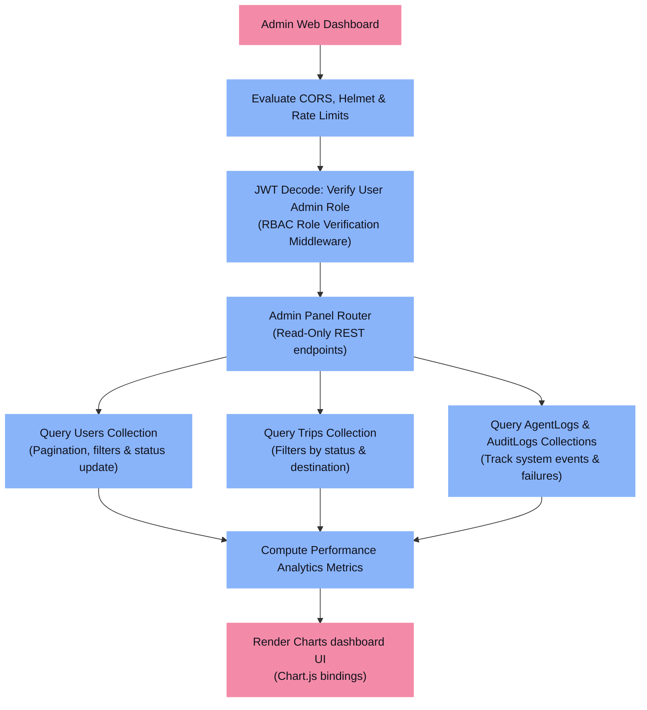
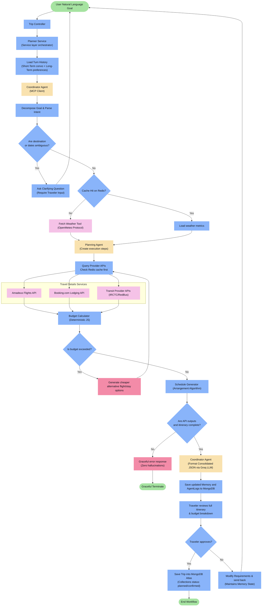

# Travel Planner AI Agent - Capstone Project Documentation

This repository contains the architecture, workflow designs, and database/infrastructure details for the Travel Planner AI Client/Server application. The system is designed as a production-grade enterprise application integrating the principles and technologies studied from **Week 1 through Week 5**.

---

## 1. Traveler Workflow

Traces the execution path starting from client-side Zod form validation, Express router middleware stack, Planner Service, caching, sequential agent execution, deterministic calculations, human-in-the-loop, database collections, and decoupled background worker queues.

```mermaid
graph TD
    %% Styling and config
    classDef default fill:#1e1e2e,stroke:#cdd6f4,stroke-width:2px,color:#cdd6f4;
    classDef startEnd fill:#a6e3a1,stroke:#a6e3a1,stroke-width:2px,color:#11111b;
    classDef process fill:#89b4fa,stroke:#89b4fa,stroke-width:2px,color:#11111b;
    classDef agent fill:#f9e2af,stroke:#f9e2af,stroke-width:2px,color:#11111b;
    classDef api fill:#f5c2e7,stroke:#f5c2e7,stroke-width:2px,color:#11111b;
    classDef queue fill:#fab387,stroke:#fab387,stroke-width:2px,color:#11111b;
    
    Traveler([Traveler]):::startEnd --> ClientInput["Dashboard Input Form<br/>(Client Validation: Hook Form + Zod)"]:::process
    ClientInput --> SecurityStack["Express Security Middlewares<br/>(CORS, Helmet, Rate-Limiters)"]:::process
    SecurityStack --> Auth["JWT Decode & RBAC Validation Middleware"]:::process
    
    Auth --> FetchData["Fetch User Dashboard Data<br/>(TanStack Query caching, API Pagination & Filters)"]:::process
    FetchData --> Create["Create New Trip Request"]:::process
    FetchData --> View["View Existing Trips & Conversations / Delete Trip"]:::process
    
    Create --> InputGoal["Enter Goal Input (e.g., Manali, 5 days, ₹30,000)"]:::process
    View --> InputGoal
    
    InputGoal --> ExpressRouter["Express.js Server Router<br/>Morgan/Winston Logging"]:::process
    ExpressRouter --> PlannerService["Planner Service Layer<br/>(Decouples controller from AI routing)"]:::process
    
    %% Load session memory
    PlannerService --> FetchMem["Load Session Memory<br/>(Short-Term conversation + Long-Term preferences)"]:::process
    FetchMem --> Orchestrator["Coordinator Agent<br/>(Orchestrator checking goal parameters validity)"]:::agent
    
    Orchestrator --> CheckAmb{"Are destination<br/>or dates ambiguous?"}:::process
    CheckAmb -->|Yes| Clarify["Ask Clarifying Question<br/>(Requires traveler input)"]:::process
    Clarify --> Traveler
    
    %% Sequential execution with weather first
    CheckAmb -->|No| WeatherCheck{"Weather cached in Redis?"}:::process
    WeatherCheck -->|No| WeatherAPI["Fetch Weather Tool (OpenMeteo MCP)<br/>(Cache response in Redis)"]:::api
    WeatherCheck -->|Yes| GetCache["Load cached weather metrics"]:::process
    
    WeatherAPI --> PlanningAgent["Planning Agent<br/>(Formulates reasoning plan)"]:::agent
    GetCache --> PlanningAgent
    
    %% APIs (External providers)
    PlanningAgent --> CallAPIs["Query Provider APIs<br/>Check Redis cache first"]:::process
    subgraph Providers ["Travel Details Providers"]
        Amadeus["Amadeus Flights API"]:::api
        IRCTC["IRCTC Trains API"]:::api
        RedBus["RedBus Commute API"]:::api
        Booking["Booking.com Lodging API"]:::api
        Airbnb["Airbnb Homestays API"]:::api
    end
    CallAPIs --> Amadeus
    CallAPIs --> IRCTC
    CallAPIs --> RedBus
    CallAPIs --> Booking
    CallAPIs --> Airbnb
    
    %% Real Data gathering
    Amadeus -.-> MergeData["Consolidate Provider Data"]:::process
    IRCTC -.-> MergeData
    RedBus -.-> MergeData
    Booking -.-> MergeData
    Airbnb -.-> MergeData
    
    %% Mathematical Checks
    MergeData --> BudgetJS["Deterministic Budget Calculator<br/>(Runs math total calculations)"]:::process
    BudgetJS --> VerifyBudget{"Is budget exceeded?"}:::process
    VerifyBudget -->|Yes| AltAgent["Planning Agent<br/>(Recalculates cheaper provider options)"]:::agent
    AltAgent --> CallAPIs
    
    VerifyBudget -->|No| ScheduleGen["Schedule Generator<br/>(Structured routing execution algorithm)"]:::process
    ScheduleGen --> CompileAgent["Coordinator Agent<br/>(Applies LLM as a dynamic formatter of JSON data)"]:::agent
    
    CompileAgent --> HITL{"Human-in-the-Loop Check<br/>Traveler reviews plan details"}:::process
    HITL -->|Review/Reject| Modify["Modify Parameters / Conversation Turn"]:::process
    Modify --> InputGoal
    
    %% Save to DB collections
    HITL -->|Approve| SaveDB["Save Trip to Database<br/>Collections: Trips, Conversations, Sessions"]:::process
    
    %% Async Jobs decoulped
    SaveDB --> QueuePush["Push event to Redis Job Queue<br/>(BullMQ)"]:::queue
    QueuePush --> ResponseClient([Response returned to Client Dashboard]):::startEnd
    
    %% Background worker thread
    subgraph BackgroundCluster ["Background Processing Layer"]
        QueuePush --> Worker["Background Process Workers"]:::queue
        Worker --> NotificationService["Notification Service"]:::queue
        NotificationService --> Email["SMTP Email Client"]:::api
        NotificationService --> SMS["Twilio SMS Client"]:::api
        NotificationService --> Push["Firebase Push alerts"]:::api
        Worker --> CalendarTool["Sync Calendar (Google Calendar API)"]:::api
    end
```

---

## 2. Admin Workflow

Details admin authorization, role validation middleware, navigation to administrative management sections, and metrics visualization dashboards. Admin features fetch directly from indexed MongoDB databases without invoking LLM agents.

---

## 3. AI Agent Internal Flow

Highlights sequential planning execution and conditional routing (handling ambiguity, weather forecasts, grounded API queries, budget validity checks, final plan generation, and background execution).

---

## 4. Project Development Workflow

Illustrates the Git workflow, Continuous Integration pipeline via GitHub Actions, Docker build steps, Terraform IaC provisioning, and deployment endpoints on AWS.

---

## 5. Complete System Architecture

Maps out the production-grade tier boundaries: Frontend Web Client (Zod/Tanstack), Express.js controller / security middlewares, Planner Service orchestrator, Redis Caches, BullMQ Job Queues, Background Workers, MongoDB database collections, and external APIs.

```mermaid
graph TD
    %% Styling
    classDef default fill:#1e1e2e,stroke:#cdd6f4,stroke-width:2px,color:#cdd6f4;
    classDef frontend fill:#89b4fa,stroke:#89b4fa,stroke-width:2px,color:#11111b;
    classDef backend fill:#a6e3a1,stroke:#a6e3a1,stroke-width:2px,color:#11111b;
    classDef db fill:#f9e2af,stroke:#f9e2af,stroke-width:2px,color:#11111b;
    classDef ext fill:#f5c2e7,stroke:#f5c2e7,stroke-width:2px,color:#11111b;
    classDef queue fill:#fab387,stroke:#fab387,stroke-width:2px,color:#11111b;

    %% Frontend Tier
    subgraph ClientTier ["Frontend Client (React TS - Week 3)"]
        FE["React Dashboard UI<br/>(Tailwind CSS)"]:::frontend
        Val["Form Validation<br/>(React Hook Form + Zod)"]:::frontend
        State["State Manager<br/>(Zustand / Context API)"]:::frontend
        Queries["API Client<br/>(TanStack Query / Axios)"]:::frontend
        ChartsFE["Visualizations<br/>(Chart.js Analytics UI)"]:::frontend
        AuthFE["JWT Secure Storage<br/>(LocalStorage/HTTPOnly Cookies)"]:::frontend
    end

    %% Backend Server Tier
    subgraph ServerTier ["Backend Server (Node.js/Express MVC + Service - Week 2)"]
        API["Express.js Server Router"]:::backend
        
        subgraph Middlewares ["Express.js Security Middleware Chain"]
            BHelmet["Helmet Security Headers"]:::backend
            BCors["CORS Access Controls"]:::backend
            Throttle["API Rate Limiter"]:::backend
            LogLog["Morgan / Winston Logger"]:::backend
            JWT["JWT Validation & Authorization"]:::backend
            RBAC["RBAC Role Validator"]:::backend
            ErrorM["Global Error Handler"]:::backend
        end
        
        API --> BHelmet --> BCors --> Throttle --> LogLog --> JWT --> RBAC
        
        PlannerService["Planner Service<br/>(Core Business Logic Handler)"]:::backend
        RBAC --> PlannerService
        
        RedisCache["Redis Cache Manager<br/>(Caches weather & API details)"]:::backend
        PlannerService --> RedisCache
        
        %% Redis Event Queue
        BullMQ["Redis Event Queue manager<br/>(BullMQ Producer)"]:::queue
        PlannerService --> BullMQ
        
        %% Agents Layer
        subgraph agents ["AI Agent Cluster (Agentic AI - Week 5)"]
            CoordAgent["Coordinator Agent<br/>(MCP Client - Intent check & parsing)"]:::backend
            PlanAgent["Planning Agent<br/>(Grounded tool orchestrator)"]:::backend
        end
        
        PlannerService --> CoordAgent
        CoordAgent --> PlanAgent
        
        %% Deterministic Sub-modules
        subgraph DeterministicModules ["Deterministic Logic Layer"]
            BudgetJS["Budget Calculator<br/>(Determines math limits)"]:::backend
            ScheduleGen["Schedule Generator<br/>(Sequences itinerary entries)"]:::backend
        end
        
        PlanAgent --> BudgetJS
        PlanAgent --> ScheduleGen
        BudgetJS --> CoordAgent
        ScheduleGen --> CoordAgent
    end

    %% Background Processing Tier
    subgraph WorkerTier ["Background Worker Pool (BullMQ Cluster)"]
        MQWorker["Queue Processing worker"]:::queue
        NotifService["Notification Service"]:::queue
        
        BullMQ -.->|Redis PubSub| MQWorker
        MQWorker --> NotifService
    end

    %% Storage Tier (MongoDB Collections)
    subgraph DBTier ["Database & Storage (Week 1 / 2)"]
        subgraph MongoDBCollections ["MongoDB Collections (Indexed)"]
            UsersTable[("Users collection")]:::db
            TripsTable[("Trips collection")]:::db
            ConvsTable[("Conversations collection")]:::db
            LogsTable[("AgentLogs collection")]:::db
            NotLogsTable[("Notifications collection")]:::db
            AudLogsTable[("AuditLogs collection")]:::db
            SessTable[("Sessions collection")]:::db
        end
    end

    %% External Tier
    subgraph ExtTier ["External Services & Infrastructure (Week 4)"]
        LLM["Groq LLM API<br/>(Formatting Engine)"]:::ext
        
        subgraph LCTools ["Standardized MCP Servers / APIs"]
            WeatherTool["Weather MCP Server<br/>(OpenMeteo Protocol)"]:::ext
            TransitAPI["Transit Providers API<br/>(Amadeus, IRCTC, RedBus)"]:::ext
            LodgingAPI["Lodging Providers API<br/>(Booking.com, Airbnb, Agoda)"]:::ext
            CalendarTool["Calendar MCP Server<br/>(Google Calendar API)"]:::ext
        end
        
        AWSSecrets["AWS Secrets Manager / KMS"]:::ext
        CloudWatch["Amazon CloudWatch Logging"]:::ext
        TwilioAPI["Twilio SMS Gateway"]:::ext
        SMTPEmail["SMTP Email Service"]:::ext
    end

    %% Connect UI controls
    FE --> Val --> Queries
    Queries --> AuthFE
    ChartsFE --> FE

    %% Core Data flow
    Queries -->|JSON REST Requests| API
    PlannerService -->|Search & Update History| ConvsTable
    PlannerService -->|Session tracking| SessTable
    PlannerService -->|Account profiles| UsersTable
    PlannerService -->|Audit Access| AudLogsTable
    
    PlanAgent -->|Write Execution Logs| LogsTable
    CoordAgent -->|Inference Query| LLM
    PlanAgent -->|Standardized MCP Requests| LCTools
    CoordAgent -->|Store Completed Trip Profile| TripsTable
    PlannerService -->|Read Cloud Keys| AWSSecrets
    API -.->|Metrics & Diagnostics| CloudWatch
    
    %% Workers Integration
    NotifService --> TwilioAPI
    NotifService --> SMTPEmail
    NotifService -->|Publish Alerts| NotLogsTable
    MQWorker --> CalendarTool
    
    %% Direct Database fetch for Admin Dashboard (No AI)
    API -->|Query metrics and logs| TripsTable
    API -->|Query audit reports| LogsTable
    
    TripsTable -->|Return Results| API
    API -->|Send JSON Payload Response| Queries
```

