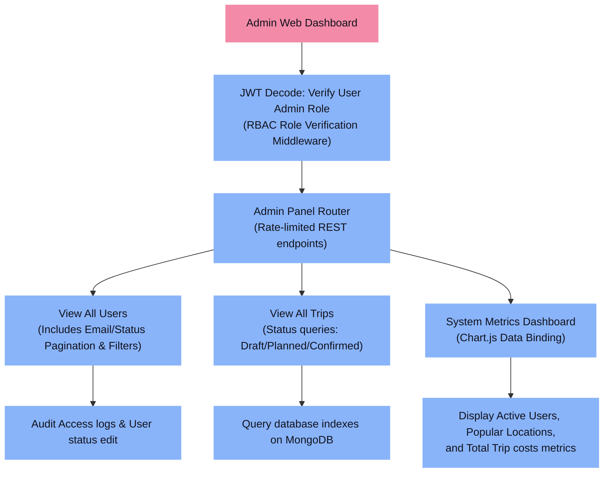
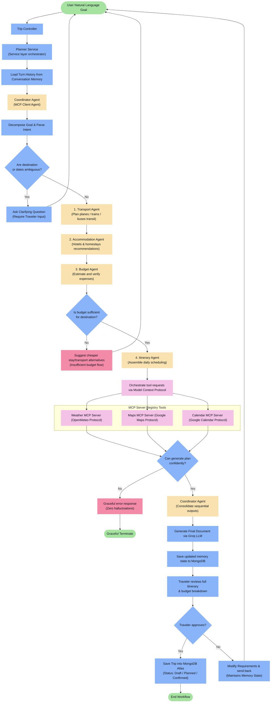
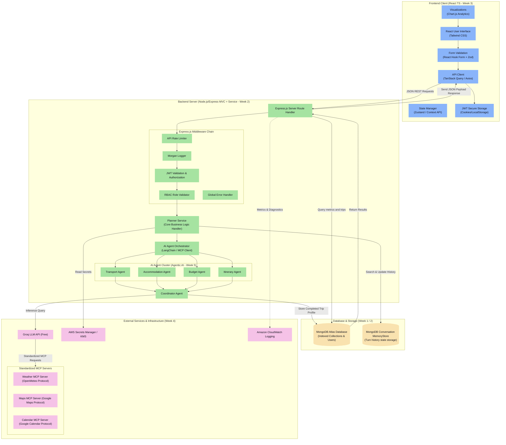

# Travel Planner AI Agent - Capstone Project Documentation

This repository contains the architecture, workflow designs, and system integration details for the Travel Planner AI Client/Server application. The project serves as a comprehensive capstone integrating the architectural principles and technologies studied from **Week 1 through Week 5**.

---

## 1. Traveler Workflow

Traces the execution path starting from client-side Zod form validation, JWT validation, service orchestration, standardized MCP tool calling protocols, and human-in-the-loop validation, down to MongoDB persistence.

```mermaid
graph TD
    %% Styling and config
    classDef default fill:#1e1e2e,stroke:#cdd6f4,stroke-width:2px,color:#cdd6f4;
    classDef startEnd fill:#a6e3a1,stroke:#a6e3a1,stroke-width:2px,color:#11111b;
    classDef process fill:#89b4fa,stroke:#89b4fa,stroke-width:2px,color:#11111b;
    classDef agent fill:#f9e2af,stroke:#f9e2af,stroke-width:2px,color:#11111b;
    classDef api fill:#f5c2e7,stroke:#f5c2e7,stroke-width:2px,color:#11111b;
    
    Traveler([Traveler]):::startEnd --> ClientInput["Dashboard Input Form<br/>(Client Validation: Hook Form + Zod)"]:::process
    ClientInput --> Auth["User Registration / Login<br/>JWT/RBAC Auth Middleware"]:::process
    Auth --> FetchData["Fetch User Dashboard Data<br/>(TanStack Query caching, API Pagination & Filters)"]:::process
    
    FetchData --> Create["Create New Trip Request"]:::process
    FetchData --> View["View Existing Trips / Delete Trip"]:::process
    
    Create --> InputGoal["User enters Goal Input (includes Destination)<br/>e.g., 'Plan a 5-day trip to Manali for 2 people within ₹30,000'"]:::process
    View --> InputGoal
    
    InputGoal --> ExpressRouter["Express.js Server Router<br/>Rate-limiting via express-rate-limit<br/>Morgan/Winston Session Logging"]:::process
    
    ExpressRouter --> PlannerService["Planner Service Layer<br/>(Separates controller from AI orchestration)"]:::process
    PlannerService --> FetchMem["Load Turn History from Conversation Memory"]:::process
    
    FetchMem --> Orchestrator["Coordinator Agent<br/>(MCP Client Agent utilizing Memory context)"]:::agent
    Orchestrator --> ParseIntent["Understand User Intent & Input Requirements"]:::process
    ParseIntent --> SplitTasks["Break Input into Sub-Tasks"]:::process
    
    SplitTasks --> TransAgent["Transport Agent<br/>Plan transit connections to destination"]:::agent
    SplitTasks --> AccomAgent["Accommodation Agent<br/>Search hotels & homestays"]:::agent
    
    TransAgent --> BudgetAgent["Budget Agent<br/>(Estimate costs & breakdown)"]:::agent
    AccomAgent --> BudgetAgent
    
    BudgetAgent --> ItinAgent["Itinerary Agent<br/>Assemble scheduling sequence"]:::agent
    
    ItinAgent --> Coordinator["Coordinator Agent<br/>(Aggregates agent data)"]:::agent
    
    Coordinator --> ToolCall["MCP Client Tool Request<br/>(Launches standardized MCP protocol requests)"]:::api
    
    ToolCall --> GenPlan["Generate Final Travel Plan via Groq API (Free)<br/>(Async/Await processing)"]:::process
    GenPlan --> HITL{"Human-in-the-Loop Confirmation<br/>'Do you approve this travel plan?'"}:::process
    
    HITL -->|Approve| SaveDB["Save Trip to MongoDB Atlas<br/>(Mongoose write validations)"]:::process
    HITL -->|Reject| ModifyReq["Modify Requirements & Send Back"]:::process
    
    SaveDB --> ScheduleRem["Schedule Reminders (Calendar MCP Server Tool)"]:::process
    ModifyReq --> Orchestrator
    
    ScheduleRem --> UpdateStatus["Update Trip Status<br/>(Draft ➔ Planned ➔ Confirmed)"]:::process
    UpdateStatus --> DashboardUpdate([User Dashboard UI Updated]):::startEnd
```

---

## 2. Admin Workflow

Details admin authorization, role validation middleware, navigation to administrative management sections, and metrics visualization dashboards. Admin features fetch directly from database indexes without hitting AI interface layers.

---

## 3. AI Agent Internal Flow

Highlights sequential planning execution and conditional routing (handling ambiguity, budget checks, confidence failures, MCP tool calling, and human validation) to complete traveler goals.

---

## 4. Project Development Workflow

Illustrates the Git workflow, Continuous Integration pipeline via GitHub Actions, Docker builds, Terraform IaC provisioning, and deployment endpoints on AWS.

---

## 5. Complete System Architecture

Maps out the structural tier boundaries: Frontend Web Client, Service Layer context, AI Agent orchestration cluster, External MCP Integrations, and persistent database layers.

