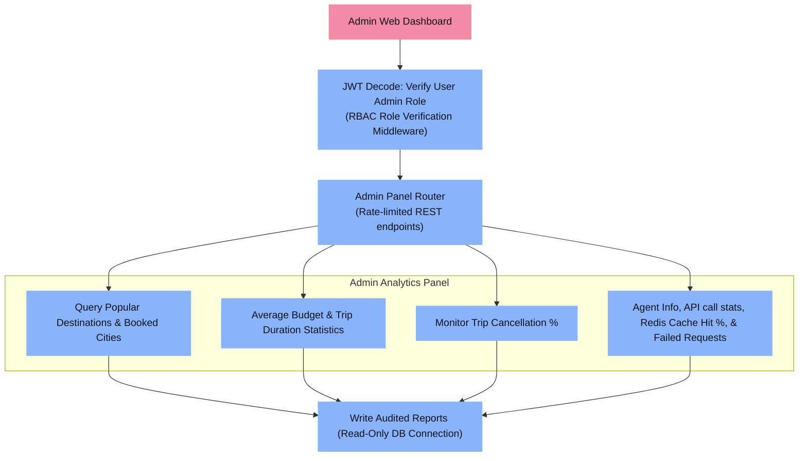
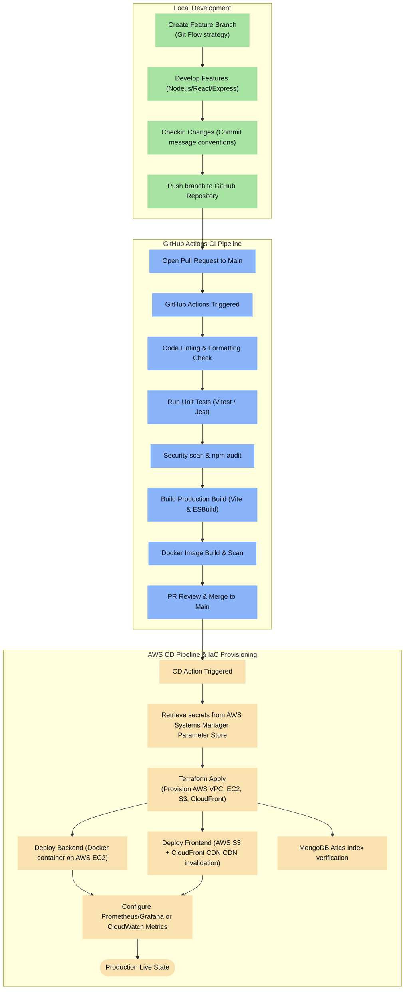
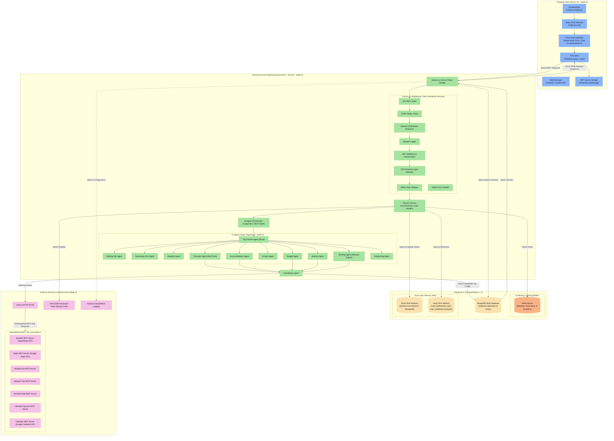

# Travel Planner AI Agent - Capstone Project Documentation

This repository contains the architecture, workflow designs, and system integration details for the Travel Planner AI Client/Server application. The project serves as an enterprise-grade capstone integrating the architectural principles and technologies studied from **Week 1 through Week 5**.

---

## MAP: Applied Curriculum Topics
* **Week 1 (Foundations & DSA)**: MongoDB Indexing configuration (`userId`, `tripId`, `status`), schema validations, and Git Branching strategies.
* **Week 2 (Backend)**: Express.js REST application styled as **MVC structure with Planner Services**, global rates throttling, Morgan logs, JWT validation, and RBAC auth.
* **Week 3 (Frontend)**: React Single Page Application utilizing Vite, Zustand state, **React Hook Form + Zod input verification** (limited to authentication), caching via **TanStack Query**, and **Chart.js** data visualizations.
* **Week 4 (DevOps)**: GitHub Actions test loops, Docker container packaging, and infra automation using **Terraform on AWS (EC2 / S3 / CloudFront / Security Groups)**.
* **Week 5 (Agentic AI)**: Multi-agent coordination (Transport, Accommodation, Budget, and Itinerary agents) orchestrated by a **Coordinator Agent** using **Groq LLM API**, featuring the **Model Context Protocol (MCP)** for standardized tool calling configuration, dual-layer conversation memory, Redis query caching, and human-in-the-loop validation.

---

## 1. Traveler Workflow

Traces the execution path starting from client-side Zod auth validation, JWT authorization, service orchestration, standardized tool calling, parallel data retrieval, sequential budgeting, human-in-the-loop review, and mock bookings down to persistent storage.

```mermaid
graph TD
    %% Styling and config
    classDef default fill:#1e1e2e,stroke:#cdd6f4,stroke-width:2px,color:#cdd6f4;
    classDef startEnd fill:#a6e3a1,stroke:#a6e3a1,stroke-width:2px,color:#11111b;
    classDef process fill:#89b4fa,stroke:#89b4fa,stroke-width:2px,color:#11111b;
    classDef agent fill:#f9e2af,stroke:#f9e2af,stroke-width:2px,color:#11111b;
    classDef api fill:#f5c2e7,stroke:#f5c2e7,stroke-width:2px,color:#11111b;
    classDef cache fill:#fab387,stroke:#fab387,stroke-width:2px,color:#11111b;
    
    Traveler([Traveler]):::startEnd --> Auth["Auth (Zod + Hook Form)"]:::process
    Auth --> JWTIssue["JWT Issued (RBAC)"]:::process
    JWTIssue --> FetchData["Fetch User Dashboard Data<br/>(TanStack Query Cache)"]:::process
    
    FetchData --> DashboardView{"Select Action"}:::process
    DashboardView -->|Create Trip| BaseGoal["Conversational Chat Input"]:::process
    DashboardView -->|Manage Trips| HistoryGroup["History Groups<br/>(Upcoming / Completed / Cancelled / Drafts)"]:::process
    
    HistoryGroup --> DeleteReq["Delete / Cancel Request"]:::process
    DeleteReq --> ExpressRouter["Express Server Router<br/>(Helmet / CORS / Rate Limiting)"]:::process
    
    BaseGoal --> ExpressRouter
    
    ExpressRouter --> PlannerService["Planner Service<br/>(Business Logic)"]:::process
    PlannerService --> FetchMem["Load Memory<br/>(Short + Long Term)"]:::process
    
    FetchMem --> Planner["Trip Planner Agent<br/>(Cognitive Brain)"]:::agent
    
    Planner --> CheckMiss["Missing Info Agent"]:::agent
    CheckMiss --> CheckData{"Missing critical info?"}:::process
    
    CheckData -->|Yes| Clarify["Ask Clarifying Question<br/>(Prompt for missing fields)"]:::process
    Clarify --> BaseGoal
    
    CheckData -->|No| DestCheck{"Destination present?"}:::process
    DestCheck -->|No| DestRec["Dest Rec Agent<br/>(Based on weather/budget/history)"]:::agent
    
    DestRec --> Coordinator["Coordinator Agent<br/>(MCP Client Agent)"]:::agent
    DestCheck -->|Yes| Coordinator
    
    %% --- Parallel Agent Execution ---
    subgraph ParallelTasks ["Stage 1: Parallel Data Retrieval"]
        WeatherAgent["Weather Agent<br/>(Forecast early)"]:::agent
        TransAgent["Transport Agent<br/>(Transit schedules)"]:::agent
        AccomAgent["Accom Agent<br/>(Hotels & homestays)"]:::agent
        ActAgent["Activity Agent<br/>(Attractions & dining)"]:::agent
        LocalTrans["Local Transport Agent<br/>(Cabs & transfers)"]:::agent
    end
    
    Coordinator --> WeatherAgent
    Coordinator --> TransAgent
    Coordinator --> AccomAgent
    Coordinator --> ActAgent
    Coordinator --> LocalTrans
    
    %% Redis Cache Integration
    ParallelTasks --> CheckCache{"Cache Hit in Redis?"}:::cache
    CheckCache -->|No| MCPRequests["MCP Server Requests<br/>(Weather / Maps MCP)"]:::api
    CheckCache -->|Yes| JoinTasks["Aggregate Parallel Outputs"]:::process
    
    MCPRequests --> WriteCache["Write to Redis Cache"]:::cache
    WriteCache --> JoinTasks
    
    %% --- Sequential Agent Execution ---
    subgraph SequentialTasks ["Stage 2: Sequential Planning"]
        BudgetAgent["Budget Agent<br/>(Breakdown & Emergency Fund)"]:::agent
        ItinAgent["Itinerary Agent<br/>(Daily schedule details)"]:::agent
    end
    
    JoinTasks --> BudgetAgent
    BudgetAgent --> ItinAgent
    
    ItinAgent --> Summarize["Coordinator Agent<br/>(Synthesize markdown plan)"]:::agent
    
    Summarize --> HITL{"Human-in-the-Loop Confirmation"}:::process
    
    HITL -->|Reject| ModifyReq["Modify via Replanning Agent"]:::agent
    ModifyReq --> BaseGoal
    
    HITL -->|Approve| BookingSystem["Mocked Booking Agent<br/>(Mock reservations & payments)"]:::agent
    
    BookingSystem --> SaveDB["Save Trip to MongoDB Atlas<br/>(Status: Booked)"]:::process
    
    SaveDB --> Notifications["Dispatch Notifications<br/>(Calendar Sync / Email / Push Alerts)"]:::process
    
    Notifications --> UpdateStatus["Update Trip Status Enums<br/>(Planning ➔ Awaiting Approval ➔ Booked)"]:::process
    UpdateStatus --> DashboardUpdate([Dashboard Updated]):::startEnd
```



---

## 2. Admin Workflow

Details admin authorization, role validation middleware, navigation to administrative management sections, and metrics visualization dashboards. Admin features fetch directly from database indexes without hitting AI interface layers.



---

## 3. AI Agent Internal Flow

Highlights sequential planning execution and conditional routing (handling ambiguity, budget checks, confidence failures, MCP tool calling, and human validation) to complete traveler goals.

```mermaid
graph TD
    classDef default fill:#1e1e2e,stroke:#cdd6f4,stroke-width:2px,color:#cdd6f4;
    classDef startEnd fill:#a6e3a1,stroke:#a6e3a1,stroke-width:2px,color:#11111b;
    classDef process fill:#89b4fa,stroke:#89b4fa,stroke-width:2px,color:#11111b;
    classDef agent fill:#f9e2af,stroke:#f9e2af,stroke-width:2px,color:#11111b;
    classDef tool fill:#f5c2e7,stroke:#f5c2e7,stroke-width:2px,color:#11111b;
    classDef error fill:#f38ba8,stroke:#f38ba8,stroke-width:2px,color:#11111b;
    classDef cache fill:#fab387,stroke:#fab387,stroke-width:2px,color:#11111b;

    Goal([User Goal]):::startEnd --> Controller["Trip Controller"]:::process
    Controller --> PlannerService["Planner Service<br/>(Business Logic)"]:::process
    
    %% Turn State Memory (Dual-Layer)
    PlannerService --> FetchMem["Load Memories:<br/>1. Short-Term Memory (Session turn history)<br/>2. Long-Term Memory (User profiles & preferences)"]:::process
    
    FetchMem --> Planner["Trip Planner Agent<br/>(Orchestrator Brain)"]:::agent
    Planner --> Parse["Decompose Goal & Parse Intent"]:::process
    
    %% Inference slot checks
    Parse --> CheckData["Missing Information Agent<br/>(Detail Slot validation check)"]:::agent
    CheckData --> CheckDest{"Missing critical info?"}:::process
    
    CheckDest -->|Yes| InferSlots{"Can infer missing fields?<br/>(e.g., 'weekend' = Sat/Sun, 'family' = 2+ travelers)"}:::process
    InferSlots -->|Yes| UpdateSlots["Populate state with inferred parameters"]:::process
    InferSlots -->|No| Clarify["Ask user only for missing fields<br/>(Maintain current state context)"]:::process
    Clarify --> Goal
    
    %% Destination recommendation logic
    UpdateSlots --> DestCheck{"Is destination missing?"}:::process
    CheckDest -->|No| DestCheck
    
    DestCheck -->|Yes| DestAgent["Destination Rec Agent<br/>(Recommend locations based on season & budget constraints)"]:::agent
    DestCheck -->|No| Coord["Coordinator Agent<br/>(Initializes Hybrid Orchestration)"]:::agent
    DestAgent --> Coord
    
    %% Hybrid Parallel / Sequential Stage
    subgraph ParallelPhase ["Parallel Gathering Phase"]
        WeatherAgent["Weather Agent<br/>(Check forecasts for rain warnings)"]:::agent
        TransAgent["Transport Agent<br/>(Bus/Train transit lookups)"]:::agent
        AccomAgent["Accommodation Agent<br/>(Search stays)"]:::agent
        ActAgent["Activity Agent<br/>(Sights, restaurants, & events)"]:::agent
    end
    
    Coord --> ParallelPhase
    
    ParallelPhase --> RedisCheck{"Check caches in Redis"}:::cache
    
    %% Replanning flow integration hook
    RedisCheck -->|Miss| Tools["Invoke Standardized MCP Protocols"]:::tool
    
    subgraph LCTools ["MCP Tool Connections"]
        WeatherMCP["Weather MCP (Rain Alert Alerts)"]:::tool
        MapsMCP["Maps MCP (Distance / Route)"]:::tool
        SchedulesMCP["Transit Schedules MCP (Mocked)"]:::tool
    end
    
    Tools --> WeatherMCP
    Tools --> MapsMCP
    Tools --> SchedulesMCP
    
    RedisCheck -->|Hit| JoinGather["Collect outputs & ground data"]:::process
    WeatherMCP --> WriteC["Write to Redis"]:::cache
    MapsMCP --> WriteC
    SchedulesMCP --> WriteC
    WriteC --> JoinGather
    
    subgraph SequentialPhase ["Sequential Planning Phase"]
        BudgetAgent["Budget Agent<br/>(Breakdown: Transport, Stay, Food, local cab, 10-15% Emergency)"]:::agent
        CheckBudget{"Is specified budget<br/>impossible?"}:::process
        AltBudget["Suggest cost-saving alternatives<br/>(Hostels, sleeper train, public transport)"]:::error
        
        ItinAgent["Itinerary Agent<br/>(Draft morning, afternoon, evening, & night scheduling)"]:::agent
    end
    
    JoinGather --> BudgetAgent
    BudgetAgent --> CheckBudget
    CheckBudget -->|Yes| AltBudget
    AltBudget --> Goal
    CheckBudget -->|No| ItinAgent
    
    %% Confidence Checks
    ItinAgent --> ConfidenceCheck{"Do all coordinates & dates validate?"}:::process
    ConfidenceCheck -->|No| ErrorHandle["Error Handler<br/>(API Failure Retries / Fallbacks / Graceful Notice)"]:::error
    ErrorHandle --> EndGrace([Graceful Terminate]):::startEnd
    
    ConfidenceCheck -->|Yes| Comp["Coordinator Agent<br/>(Grounding check: do not hallucinate)"]:::agent
    Comp --> LLMFormat["Format final unified outline details using Groq LLM"]:::process
    
    LLMFormat --> SaveMem["Update Short-Term Session & Long-Term Memory Stats"]:::process
    
    SaveMem --> TravelerReview["Traveler reviews details: budget breakdown, weather & plans"]:::process
    
    TravelerReview --> Approve{"Is plan approved?"}:::process
    Approve -->|No| ReplanningAgent["Replanning Agent<br/>(Update affected segments only)"]:::agent
    ReplanningAgent --> Goal
    
    %% Mocked Booking Layer details
    Approve -->|Yes| BookingAgent["Booking Agent (Mocked)<br/>(Generate mocked PNRs, stay checks & checkouts)"]:::agent
    BookingAgent --> ConfirmDB["Save Trip to MongoDB Atlas<br/>(Status: Booked)"]:::process
    
    ConfirmDB --> EndApp([End Workflow]):::startEnd
```



---

## 4. Project Development Workflow

Illustrates the Git workflow, Continuous Integration pipeline via GitHub Actions, Docker builds, Terraform IaC provisioning, and deployment endpoints on AWS.



---

## 5. Complete System Architecture

Maps out the structural tier boundaries: Frontend Web Client, Service Layer context, AI Agent orchestration cluster, External MCP Integrations, and persistent database/caching layers.



---

## 6. Functional Execution Scenarios (Simulated Outputs)

To demonstrate how the senior architect design performs in practice, the following sections show simulated responses produced by the Agent cluster.

### A. Itinerary Agent Output
The Itinerary Agent schedules day-by-day routines structured by timeframe. It factors in checking schedules, travel delays, weather advisories (redirecting to indoor attractions if rain alerts prompt), and daily spend caps.

```markdown
# 5-Day Vacation in Ooty (Traveler Count: 2)
### Status: Draft | Month: October | Weather Note: Moderate Clear Skies

## Day 1: Chennai to Ooty Transition & Arrival
* **08:00 AM - 11:30 AM | Travel Time (Transit)**
  * Transit: Rail departure from Chennai Central to Ooty foothills (Mettupalayam).
  * Estimated Cost: ₹1,200 (2 Tickets, Sleeper Option Alternative)
* **11:30 AM - 12:00 PM | Hotel Check-in**
  * Activity: Check-in at Ooty Vista Inn.
  * Travel Time: 20 mins cab transfer from terminal station.
* **12:00 PM - 01:30 PM | Dining (Lunch suggestion)**
  * Restaurant: Garden View Cafe (Local experiences, veg focus).
  * Opening Hours: 11:00 AM - 10:00 PM | Estimated Cost: ₹600
* **01:30 PM - 03:00 PM | Relaxation & Unpacking**
  * Accommodation Note: Hotel amenities tour.
* **03:00 PM - 05:30 PM | Afternoon Sightseeing**
  * Destination: Government Botanical Garden.
  * Timings: 07:00 AM - 06:30 PM | Entry Fee: ₹100 for 2 adults.
  * Weather Consideration: Clear Skies, open air activity highly recommended.
* **05:30 PM - 07:30 PM | Evening Activity**
  * Destination: Ooty Tea Factory & Museum Museum.
  * Timings: 09:00 AM - 07:00 PM | Ticket Cost: ₹50
* **08:00 PM - 09:30 PM | Dinner**
  * Restaurant: Mountain Retreat Dining.
  * Estimated Cost: ₹800
* **Day 1 Total Estimated Cost**: ₹2,750 (Excluding hotel block room reservation)
```

### B. Budget Agent Expense Report
The Budget Agent analyzes all estimated costs compiled by the parallel agents and outputs a strict audit report including an emergency buffer.

| Expense Category | Item Details | Estimated Cost |
|:---|:---|:---:|
| **Transport** | Transit train fares (Coimbatore/Mettupalayam rail connection) | ₹1,800 |
| **Hotel** | 4 Nights at Ooty Vista Inn (Stays class accommodation) | ₹8,500 |
| **Food / Dining** | Meal allowances, breakfast packages, local recommendations | ₹4,000 |
| **Activities** | Entry tickets, botanical gardens, tea estate slots | ₹3,500 |
| **Local Transport** | Station transfer cabs, local auto charges | ₹2,500 |
| **Emergency Fund** | 10% Reserve Buffer calculated for local disruptions | ₹2,030 |
| **Grand Total** | Summary of all categories including emergency fund | **₹22,330** |
| **Remaining Budget** | Safety variance (based on base limit of ₹30,000) | **₹7,670** |

---

## 7. Tech Stack

| Layer | Technology | Purpose | Free Tier Status |
|:------|:-----------|:--------|:-----------------|
| **Frontend** | React (TypeScript) | Single Page Application UI | 100% Free |
| | Vite | Dev server & production bundler | 100% Free |
| | Tailwind CSS | Utility-first styling framework | 100% Free |
| | React Hook Form + Zod | Authentication forms state & validation schema | 100% Free |
| | TanStack Query | Query caching, pagination & dashboard HTTP states | 100% Free |
| | Zustand / Context API | Client-side stores & local session state | 100% Free |
| | Chart.js | Admin analytical statistics visualizer | 100% Free |
| | Axios | REST HTTP Requests Client | 100% Free |
| **Backend** | Node.js + Express.js | REST API server (MVC code structure) | 100% Free |
| | Mongoose | MongoDB ODM schema rules & index tracking | 100% Free |
| | JSON Web Token (JWT) | Authentication & security roles | 100% Free |
| | bcrypt | Password hashing security controls | 100% Free |
| | express-rate-limit | API endpoint rate throttling | 100% Free |
| | Helmet | Express header validation security | 100% Free |
| | CORS | Domain access policy configurations | 100% Free |
| | Morgan / Winston | Request tracing & server diagnostic records | 100% Free |
| **AI / Agents** | Groq LLM API | AI Inference operations (Llama 3 execution model) | 100% Free Developer Tier |
| | LangChain JS | AI Agent chain orchestration framework | 100% Free |
| | Model Context Protocol (MCP) | Interface structure standard for tool integrations | 100% Free |
| **Database & Caching** | MongoDB Atlas | Primary database (Indexed scopes, users & trips) | Shared M0 Cluster — 100% Free |
| | Redis | In-memory API query caching (weather data, schedules) | 100% Free (Self-hosted on EC2 or Redis Cloud Free) |
| **DevOps & Infra** | GitHub Actions | Automatically triggers CI/CD build scripts | 2,000 build minutes/month Free |
| | Docker | System container orchestration packaging | 100% Free Community Tier |
| | Terraform | Automated infrastructure scripts (VPC/EC2/S3 config) | 100% Free CLI |
| | AWS EC2 | Server deployment platform host environment | 12-Month Free Tier (750 hours/month) |
| | AWS S3 + CloudFront | Static client file host and low latency CDN distribution | 12-Month Free Tier (5GB / 1TB Outbound) |
| | AWS SSM Parameter Store | Secure application parameter configuration storage | Always Free Tier (Up to 10,000 Parameters) |
| | Amazon CloudWatch | System alarms monitoring, health, & logging records | Standard Free Tier metrics |
| **External APIs** | OpenMeteo API | Weather forecast readings | 100% Free for Non-Commercial |
| | Google Maps API | Location geocoding & mapping coordinates | $200 Monthly Free Credit Bundle |
| | Google Calendar API | Event reminder synchronization updates | 100% Free Developer API |
| | Booking MCP Tool Engines | Mock Bus, Train, Hotel, and Payment integrations | 100% Free Mock Interfaces |
