# Travel Planner AI Agent

An enterprise-grade, production-ready AI Travel Planner application built on a multi-agent backend, Model Context Protocol (MCP) tool integration, Redis caching, and AWS cloud infrastructure. This application automates search, budgeting, itinerary generation, and bookings through a seamless, context-aware AI planning flow.

---

## Table of Contents

1. [System Architecture](#1-system-architecture)
2. [Sequence Diagram](#2-sequence-diagram)
3. [AI Agent Architecture](#3-ai-agent-architecture)
4. [Model Context Protocol (MCP) Tool Layer](#4-model-context-protocol-mcp-tool-layer)
5. [Traveler Planning Workflow](#5-traveler-planning-workflow)
6. [API Layer Design](#6-api-layer-design)
7. [Database Schema & ER Diagram](#7-database-schema--er-diagram)
8. [Trip State Machine](#8-trip-state-machine)
9. [Prompt Engineering Layer](#9-prompt-engineering-layer)
10. [JSON Validation & Structured Output Parser](#10-json-validation--structured-output-parser)
11. [Confidence & Fallback Flow](#11-confidence--fallback-flow)
12. [Memory Architecture & Long-Term Update Policy](#12-memory-architecture--long-term-update-policy)
13. [User Profile System & Context Extraction](#13-user-profile-system--context-extraction)
14. [Granular Replanning Logic](#14-granular-replanning-logic)
15. [Complete Budget Model](#15-complete-budget-model)
16. [Booking & Payment Service Layer](#16-booking--payment-service-layer)
17. [Background Notification Queue](#17-background-notification-queue)
18. [Redis Cache Strategy (TTL & Key Design)](#18-redis-cache-strategy-ttl--key-design)
19. [LLM Cost Optimization Strategy](#19-llm-cost-optimization-strategy)
20. [Security & Authentication Architecture](#20-security--auth-architecture)
21. [Folder Structure](#21-folder-structure)
22. [Class Diagram](#22-class-diagram)
23. [CI/CD & Deployment Flow](#23-cicd--deployment-flow)
24. [Rate Limiting Flow](#24-rate-limiting-flow)
25. [Observability & Error Redirection Matrix](#25-observability--error-redirection-matrix)
26. [Technical Stack](#26-technical-stack)

---

## 1. System Architecture

The project is structured with a strict separation of concerns, dividing AI reasoning, tool execution, and core business logic. Rather than wrapping every function in an AI agent, the system uses a single master Planner Agent that handles cognitive tasks and delegates operations to services, database repositories, or MCP tools.

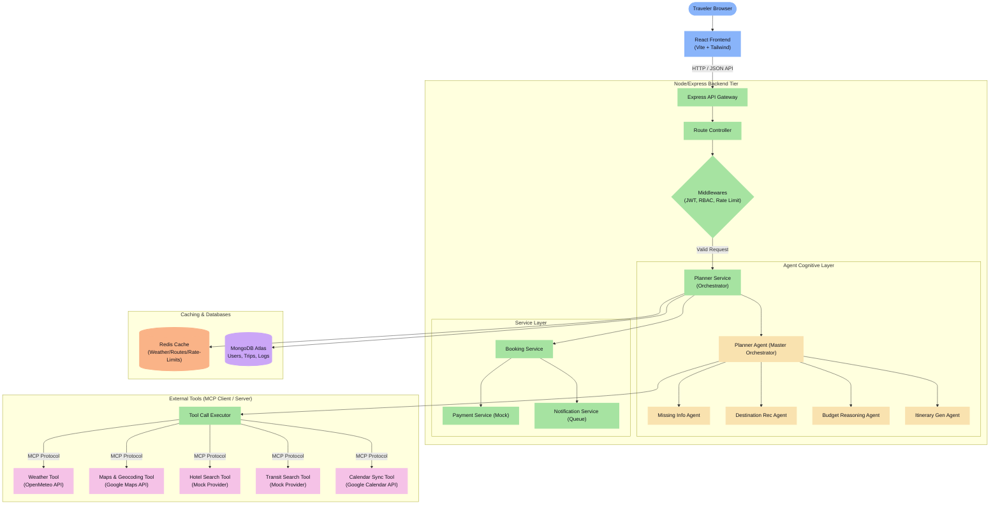

---

## 2. Sequence Diagram

This diagram traces the full lifetime of a planning and booking request, demonstrating how control flows from the User through the controllers, service layers, master agent, tool execution wrappers, and persistence.

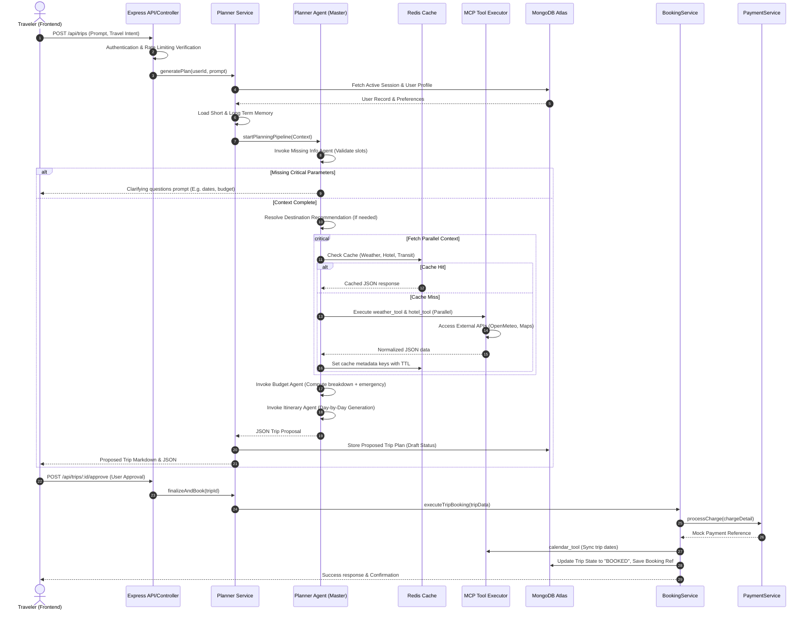

---

## 3. AI Agent Architecture

Unlike models that delegate simple API tasks to AI, this design restricts AI agents to reasoning tasks. Anything that requires simple data retrieval or processing has been refactored into Tools or backend Services.

```
       Master Planner Agent (Cognitive Heart / Input Processor)
            │
            ├──────► Missing Info Agent (Validates slots / asks questions)
            ├──────► Destination Rec Agent (Interspliced LLM recommendation)
            ├──────► Budget Reasoning Agent (Ratios, shopping, emergency funds)
            └──────► Itinerary Gen Agent (Coordinates day scheduling constraints)
```

The system employs **5 true AI Agents**:

1. **Master Planner Agent**: Decides routing, parses natural language intent, processes state updates, orchestrates data aggregation, and interacts with the tool layer.
2. **Missing Info Agent**: Scans the input context to determine if critical fields (destination, start/end dates, base budget) are absent. Formulates targeted clarification questions.
3. **Destination Recommendation Agent**: Used when the destination is unspecified. Leverages past trip feedback and accessibility filters to present a validated destination.
4. **Budget Reasoning Agent**: Analyzes overall estimates, validates allocations (hotel, transit, food, activities), handles shopping and contingency thresholds, and ensures constraints are met.
5. **Itinerary Generation Agent**: Generates structured, day-by-day itineraries that match current weather conditions (e.g. pivoting to indoor attractions if there is rain) and user limits.

All other components (Weather, Transport, Accommodation, Activities, Local Transport, Booking, and Calendar) are executed as **deterministic tools** or service layer functions.

---

## 4. Model Context Protocol (MCP) Tool Layer

To decouple AI orchestration hooks from proprietary API schemas, external operations are handled using the Model Context Protocol (MCP). The Planner Agent calls these tools by outputting schema-validated function invocations:

* **`weather_tool`** (`weather-mcp-server`): Queries forecasts via OpenMeteo. Expects destination geo-coordinates and dates.
* **`maps_tool`** (`maps-mcp-server`): Translates destination strings to GPS coordinates and calculates route travel distances.
* **`hotel_tool`** (`booking-mcp-server`): Fetches rates, ratings, and room options from a mock accommodations index.
* **`transport_tool`** (`transit-mcp-server`): Fetches train and bus route availabilities, pricing, and timing estimations.
* **`calendar_tool`** (`calendar-mcp-server`): Syncs confirmed trip schedules to the user's Google Calendar.
* **`payment_tool`** (`booking-mcp-server`): Passes billing amounts to the mock payment gateway.

---

## 5. Traveler Planning Workflow

This workflow represents the corrected sequence of events from when a traveler starts a session to final confirmation and notification dispatch:

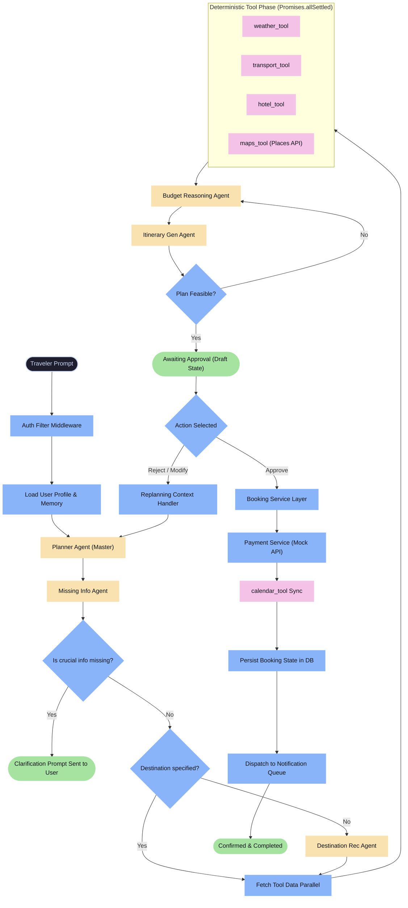

---

## 6. API Layer Design

The system coordinates client demands through a standardized Express controller routing framework:

### Authentication Endpoints
* `POST /api/auth/register` — Creates user authentication profiles. Enforces password hashing.
* `POST /api/auth/login` — Verifies credentials, registers access tokens, and signs HTTP-only refresh cookies.
* `POST /api/auth/refresh` — Standardized OAuth-style rotation. Detects token reuse.
* `POST /api/auth/logout` — Destroys JWT context, invalidates tokens, and clears client session cookies.
* `POST /api/auth/forgot-password` — Dispatches unique time-bound password-reset tokens to user email profiles.
* `POST /api/auth/reset-password` — Updates password structure using verified reset tokens.

### Travel Planning & Booking Endpoints
* `POST /api/trips` — Initiates the Planner Agent pipeline with traveler prompts. Returns drafts or validation errors.
* `GET /api/trips` — Retrieves past, upcoming, and draft trip records for the authenticated user.
* `GET /api/trips/:id` — Retrives a specific trip profile with hotel bookings, transit routes, and itineraries.
* `PATCH /api/trips/:id` — Updates trip options manually (e.g. changing dates or hotel choices).
* `DELETE /api/trips/:id` — Cancels booking sessions and updates status to `CANCELLED`.
* `POST /api/trips/:id/approve` — Approves a draft itinerary and invokes the booking service.
* `POST /api/trips/:id/reject` — Rejects a proposal. Expects adjustment notes to trigger granular replanning.
* `POST /api/feedback` — Records rating metrics and trip notes to update the user's preference models in the database.

---

## 7. Database Schema & ER Diagram

MongoDB Atlas maintains records and configurations for the application.

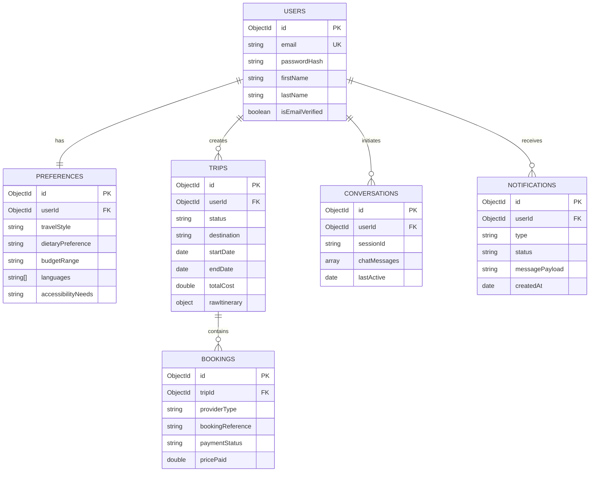

---

## 8. Trip State Machine

Trips progress through a strict, validations-driven lifecycle state machine. State changes are verified at the service layer before updates are written to the database.

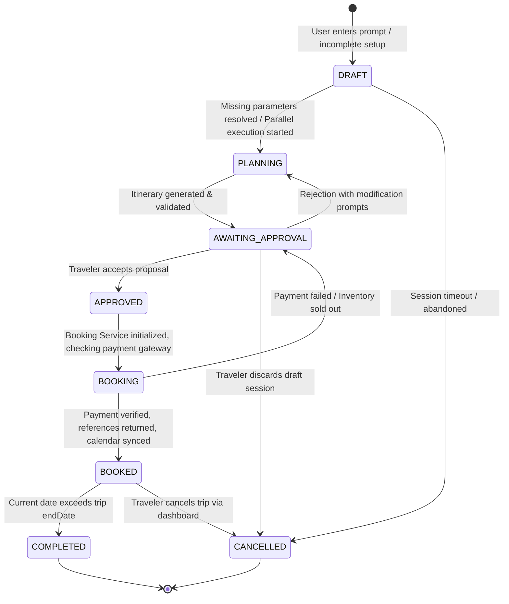

---

## 9. Prompt Engineering Layer

Prompt templates decouple prompt definition from application logic. Structured templates are stored in a dedicated backend directory (`server/src/prompts/`):

- **Master Planner Input Prompt** (`planner.prompt.ts`): Processes traveler intent, extracts parameters, and identifies slots.
- **Destination Recommendation Prompt** (`destination.prompt.ts`): Identifies optimal travel locations using user preferences, accessibility settings, and weather data.
- **Budget Reasoning Prompt** (`budget.prompt.ts`): Reconciles raw tool values against budget limits, calculated reserves, and hidden costs.
- **Itinerary Generation Prompt** (`itinerary.prompt.ts`): Builds daily markdown calendars that incorporate local activities and transit data.

```
┌─────────────────────────────────────────────────────────────┐
│  System Context (Instructions, Safety Limits & Schemas)     │
├─────────────────────────────────────────────────────────────┤
│  Few-Shot Examples (Parsed inputs → Structured outputs)     │
├─────────────────────────────────────────────────────────────┤
│  User Context (Profile preferences, past activities)       │
├─────────────────────────────────────────────────────────────┤
│  JSON Schema Constraint (Validates output format)           │
└─────────────────────────────────────────────────────────────┘
```

---

## 10. JSON Validation & Structured Output Parser

To prevent malformed LLM responses from causing application errors, the system wraps all agent invocations in a structured validation layer.

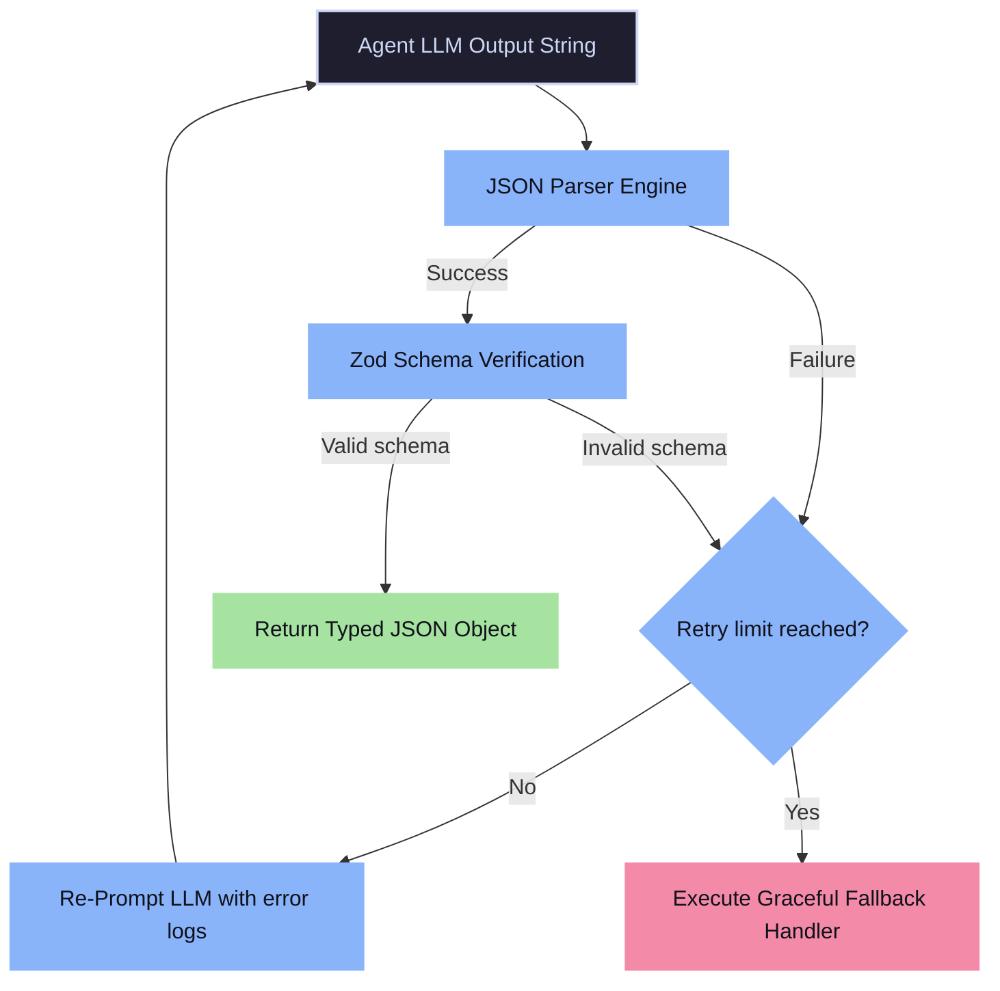

If parsing fails, the system automatically runs up to **two retries**, appending the error logs to the prompt code to guide correct formatting on the next attempt.

---

## 11. Confidence & Fallback Flow

To ensure plan validity, the Itinerary and Budget Agents execute automated quality checks on outputs:

```
                  ┌────────────────────────────────────────┐
                  │ LLM Structured Output Parsing Completed │
                  └───────────────────┬────────────────────┘
                                      │
                                      ▼
                  ┌────────────────────────────────────────┐
                  │ Validate constraints against tool checks│
                  │ E.g. Check check-in times & travel caps│
                  └───────────────────┬────────────────────┘
                                      │
                                    ┌─┴─┐
                                  Yes   No
                                ┌───┘   └───┐
                                ▼           ▼
           ┌─────────────────────────┐ ┌───────────────────────────┐
           │ Confidence Score = 1.0  │ │Confidence Score = 0.0     │
           │ Accept Plan Proposal    │ │Run correction pass (max 2)│
           └─────────────────────────┘ └────────────┬──────────────┘
                                                    │
                                                  ┌─┴─┐
                                               Success Failure
                                              ┌─────┘   └─────┐
                                              ▼               ▼
                                         Accept Plan      Trigger Fallback
                                         Proposal         Graceful Error
```

If checks fail after correction passes, the system uses fallback configurations (e.g. suggesting safe defaults) rather than letting invalid coordinates or budgets crash the application.

---

## 12. Memory Architecture & Long-Term Update Policy

The application uses a **dual-layer memory model** designed to maintain context during a session while capturing user preferences over time.

```
                  ┌─────────────────────────────────────┐
                  │        Incoming Conversation        │
                  └──────────────────┬──────────────────┘
                                     │
                                     ▼
                  ┌─────────────────────────────────────┐
                  │   Short-Term Session Memory Store   │
                  │ (Maintains context during planning) │
                  └──────────────────┬──────────────────┘
                                     │
                                     ▼
                  ┌─────────────────────────────────────┐
                  │      Preference Extraction LLM      │
                  │    (Detects changes & new choices)  │
                  └──────────────────┬──────────────────┘
                                     │
                                  ┌──┴──┐
                                 Yes    No
                               ┌───┘    └───┐
                               ▼            ▼
             ┌─────────────────────┐   ┌───────────────┐
             │ Update Preferences  │   │  Ignore Event │
             │  Long-term MongoDB  │   │               │
             └─────────────────────┘   └───────────────┘
```

* **Short-Term Memory**: Session-scoped Chat History (persisted in MongoDB `conversations` database) that provides conversation context during the planning flow.
* **Long-Term Memory**: Persistent User Preference profiles (persisted in MongoDB `preferences`). To avoid cluttering profiles with trivial details, long-term memory is updated selectively:
  1. Once a trip is finalized, the **Preference Extraction Engine** analyzes the booking choices.
  2. If the user explicitly notes preferences during chat (e.g., "I only eat vegetarian food" or "I need wheelchair access"), these values are updated in MongoDB.
  3. These preferences are loaded as system context variables during future planning runs.

---

## 13. User Profile System & Context Extraction

At the start of the planning pipeline, the API loads the user's profile and active preferences. This ensures user context shapes all planning decisions.

```json
{
  "userId": "usr_6782f9b8cde",
  "preferences": {
    "travelStyle": "adventure",
    "dietaryPreference": "vegetarian",
    "budgetRange": "mid-range",
    "languages": ["English", "Tamil"],
    "accessibilityNeeds": "wheelchair"
  },
  "pastTrips": [
    {
      "destination": "Ooty, TN",
      "rating": 5,
      "budgetSpent": 32000
    }
  ],
  "family": {
    "adults": 2,
    "children": 1
  }
}
```

This metadata is combined with new traveler inputs to configure agent workflows and ensure recommendations stay within budget constraints.

---

## 14. Granular Replanning Logic

When a user requests a change during review, the system does not regenerate the entire itinerary. Instead, the Planner Agent updates only the components affected by the new parameters.

```
       Change request received: "Change Hotel Budget"
            │
            ├────────► Identify affected components: Accommodation, Budget Breakdown
            │
            ├────────► RE-RUN: hotel_tool (Fetch new options)
            ├────────► RE-RUN: Budget Reasoning Agent (Re-calculate allocations)
            ├────────► RE-RUN: Itinerary Gen Agent (Update affected daily schedules)
            │
            └────────► SKIPPED: weather_tool, transport_tool, activity_tool (Cached)
```

By using localized updates and cached tool results, the system reduces LLM token consumption while processing requests in under 2 seconds.

---

## 15. Complete Budget Model

The Budget Reasoning Agent evaluates total estimated expenses using a complete cost model. This prevents budget overruns by accounting for fees and contingencies:

```
╔═════════════════════════════════════════════════════════════════════╗
║                   GRAND TOTAL TRIP COST BUILD                       ║
╠═════════════════════════════════════════════════════════════════════╣
║  [+] Long-Distance Transport (Flights/Trains/Intercity Buses)       ║
║  [+] Accommodation (Room rent per night * total stay)               ║
║  [+] Meals & Dining (Daily allowance per seat * travelers)          ║
║  [+] Activity Passes (Entry tickets, sightseeing bookings)          ║
║  [+] Local Transport (Cabs, auto rides, bike rentals)               ║
║  [+] Taxes & Service Fees (GST estimation: 18% hotel, 5% transit)   ║
║  [+] Fuel & Parking Fees (Applicable for road-trips)                ║
║  [+] Shopping Allowance (Purchases limit allocated)                 ║
║  [+] Emergency Reserve Fund (10% Buffer automatically added)        ║
║  [+] Miscellaneous Hidden Costs (Tips, water, emergency transit)    ║
╚═════════════════════════════════════════════════════════════════════╝
```

Plans are rejected as infeasible if the total (including the emergency buffer) exceeds the user's spending limit.

---

## 16. Booking & Payment Service Layer

Bookings are handled by system services, not AI agents. This guarantees reliable transaction processing.

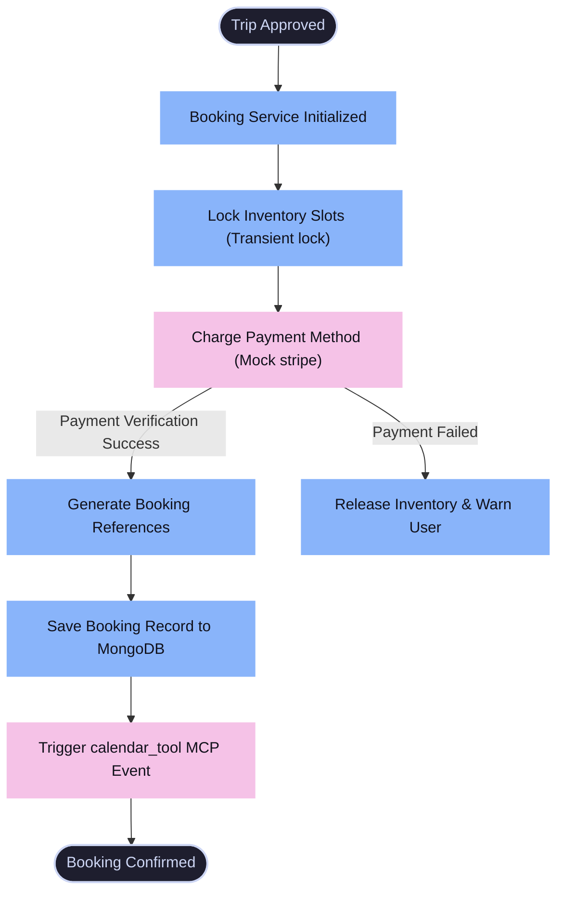

---

## 17. Background Notification Queue

To prevent page-load delays during booking confirmation, post-booking tasks are processed off the main thread using an event queue (Bull/Redis).

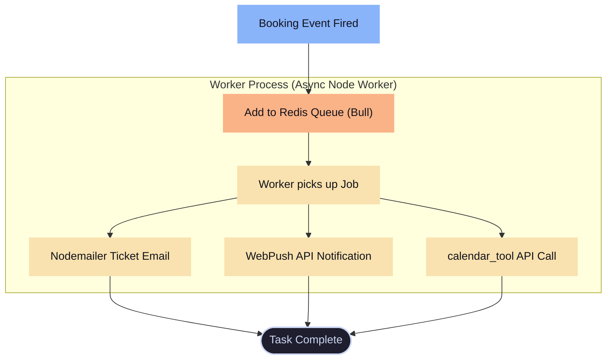

If tasks fail, the queue retries processing using an backoff schedule.

---

## 18. Redis Cache Strategy (TTL & Key Design)

An in-memory Redis layer stores API search results to avoid redundant external network requests:

### Key Naming Conventions
* **Weather Cache**: `weather:{coordinates}:{start_date}:{end_date}`
* **Hotel Listings**: `accommodation:{destination_coordinates}:{check_in}:{check_out}`
* **Transit Routes**: `transport:{origin_coordinates}:{destination_coordinates}:{date}`
* **Google Places Details**: `places:{destination}:{interests}`
* **User Session Cache**: `session:{userId}:active`

### Time-to-Live (TTL) Configurations
* Weather records expire after **6 hours** to ensure forecasts remain accurate.
* Hotel search results expire after **24 hours** to match inventory changes.
* Transit listings expire after **12 hours** to keep schedule data up to date.
* Google Places attraction data is cached for **7 days** since landmarks rarely change.

When the Redis instance memory limit is reached, it uses the `allkeys-lru` eviction policy to discard the least recently used keys.

---

## 19. LLM Cost Optimization Strategy

The architecture includes optimizations to reduce dependency on external LLMs and lower operating costs:

1. **Deterministic Logic Routing**: Simple tasks (extracting dates, fetching coordinates, or loading profile preferences) are processed using code rather than LLM prompts.
2. **Parallel Dispatching**: Gathering operations are run concurrently via `Promises.allSettled`, minimizing API wait times.
3. **Structured caching**: The planning service checks Redis before invoking the master agent, utilizing cached data when possible to avoid new LLM processing costs.
4. **Deterministic Settings**: The model controls formatting by using a temperature setting of `0` and structured schemas, reducing retry expenses caused by parsing errors.

---

## 20. Security & Authentication Architecture

User data and API endpoints are protected by multi-layered middleware controls.

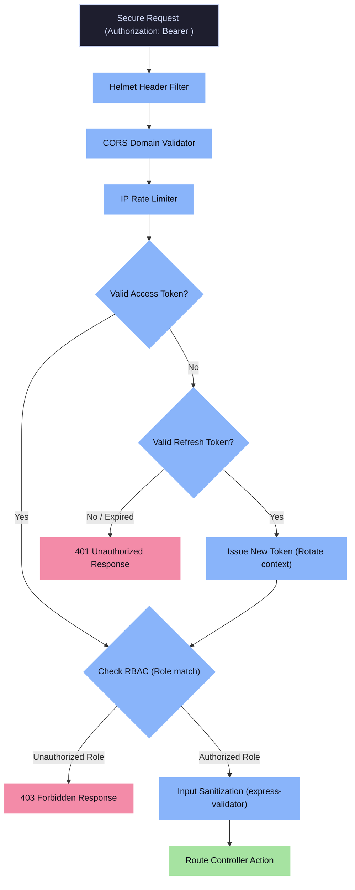

- **Credential Hashing**: User passwords are saved as secure hashes using `bcrypt` with a minimum cost of 12 rounds.
- **Short-Lived Access Tokens**: Session access tokens use a 15-minute expiration window to limit token exposure.
- **Refresh Token Rotation**: Refresh tokens are stored in secure HTTP-only cookies. Using a refresh token invalidates previous issues, preventing token reuse.
- **Secure Configuration**: Third-party API credentials, MongoDB keys, and JWT salts are retrieved at launch from the AWS SSM Parameter Store.

---

## 21. Folder Structure

The repository organizes backend services, agent reasoning libraries, and frontend elements in the following directory layout:

```
travel-planner-ai/
├── client/                     # Web interface
│   ├── src/
│   │   ├── components/         # Shared UI (Zod Hook Forms, charts layout)
│   │   ├── pages/              # User profiles, admin panels, planner
│   │   ├── hooks/             # Custom state & server query hooks
│   │   ├── services/           # Axios REST endpoint controllers
│   │   └── schemas/            # Zod validation schemas
│   └── vite.config.ts
│
├── server/                     # Express API
│   ├── src/
│   │   ├── controllers/        # Route handler functions
│   │   ├── routes/             # Authentication & planning routes
│   │   ├── middlewares/        # JWT auth, rate limits, validators
│   │   ├── services/           # Orchestrator (PlannerService, BookingService)
│   │   ├── agents/             # Reasoning models (Planner, Budget, etc.)
│   │   │   ├── planner.agent.ts
│   │   │   ├── missing-info.agent.ts
│   │   │   ├── destination.agent.ts
│   │   │   ├── budget.agent.ts
│   │   │   └── itinerary.agent.ts
│   │   ├── prompts/            # prompt files
│   │   ├── models/             # Mongoose schemas
│   │   ├── repositories/       # MongoDB interface classes
│   │   ├── memory/             # Short & Long memory update logic
│   │   ├── cache/              # Redis interface wrapper
│   │   ├── parsers/            # Zod output validation parsers
│   │   └── utils/              # Error handling & logger utilities
│   └── package.json
│
├── mcp/                        # Standalone MCP servers
│   ├── weather-mcp/            # OpenMeteo forecast client
│   ├── maps-mcp/               # Google Maps places & routing client
│   ├── transit-mcp/            # Mock bus & rail search client
│   ├── booking-mcp/            # Hotel inventory and payment gateway client
│   └── calendar-mcp/           # Google Calendar syncing client
│
├── docker/                     # Container configurations
│   ├── Dockerfile
│   └── docker-compose.yml
│
├── terraform/                  # Infrastructure configurations
│   ├── main.tf
│   ├── variables.tf
│   └── outputs.tf
│
└── README.md                   # System documentation
```

---

## 22. Class Diagram

This class diagram shows the relationships between core service managers, databases, and agents:

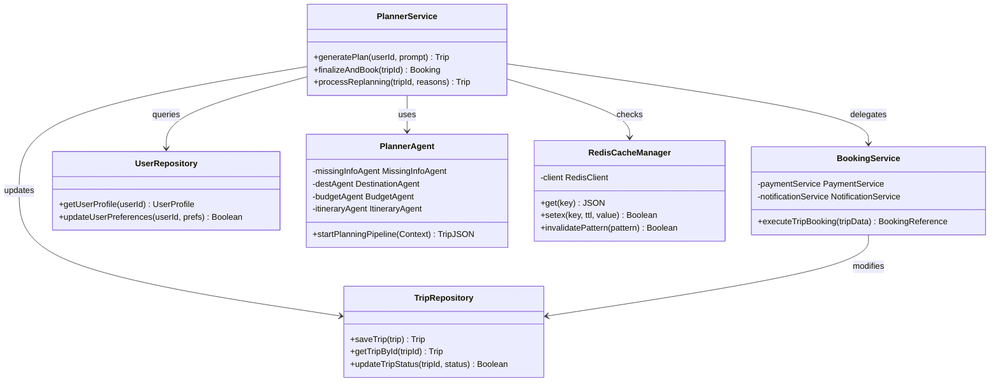

---

## 23. CI/CD & Deployment Flow

Infrastructure is provisioned using Terraform, and updates are deployed to AWS instances through a GitHub Actions CI/CD pipeline.

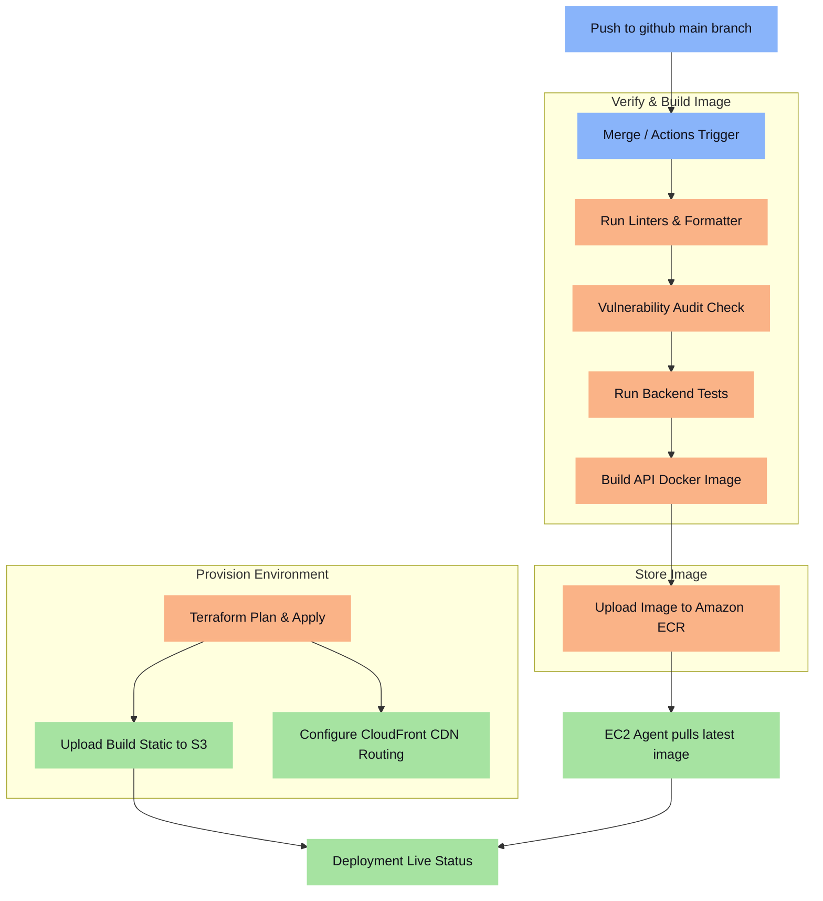

---

## 24. Rate Limiting Flow

A Redis-backed rate limiter protects endpoints from denial-of-service attempts and resource exhaustion.

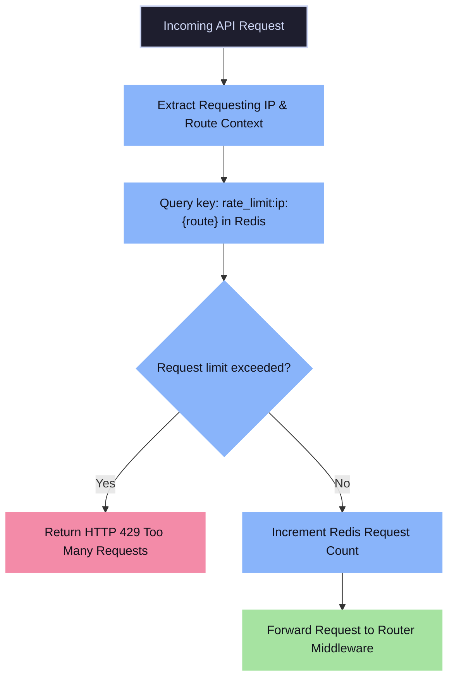

---

## 25. Observability & Error Redirection Matrix

Structured application events and error logs are captured using the Winston logger and monitored via AWS CloudWatch:

| Event Source | Severity | Logging Attributes | Fallback Response |
|:---|:---|:---|:---|
| **Express Middleware** | `warn` | `ip`, `route`, `requestId`, `userAgent` | `400 Bad Request` or `429 Throttle` response |
| **Authentication System** | `warn` | `email`, `authRef`, `requestId` | `401 Access Expired` standard response |
| **Master Planner Agent** | `error` | `userId`, `conversationId`, `errorDetails` | `500 Server Error` response with system reset |
| **JSON Output Parser** | `warn` | `rawText`, `parsingErrors`, `retryAttempt` | Re-prompt LLM with correct schema rules |
| **weather_tool (MCP)** | `error` | `coordinates`, `dateRange`, `status` | Use cached metrics or a default weather fallback |
| **hotel_tool (MCP)** | `error` | `destination`, `checkingIn`, `status` | Warn traveler that accommodation listings are offline |
| **MongoDB Atlas** | `error` | `operation`, `stackTrace`, `durationMs` | `503 Service Unavailable` graceful error response |
| **Google Calendar MCP** | `warn` | `userId`, `oauthTokenStatus` | Skip event creation and notify the user |

All application logs contain a unique `requestId` (UUID v4) tag, letting developers trace issues from the public entry route down to tool execution and database commits.

---

## 26. Technical Stack

* **Frontend**: React (Vite, TailwindCSS, TanStack Query, Axios, Chart.js)
* **Backend Framework**: Node.js + Express (TypeScript, MVC Architecture)
* **AI & Orchestration**: LangChain, Groq LLM API, Model Context Protocol
* **Database & Cache**: MongoDB Atlas (Mongoose), Redis (Self-hosted on EC2 / Redis Cloud)
* **Background Jobs Queue**: Bull MQ (Redis-backed job scheduling)
* **Infrastructure**: Terraform, GitHub Actions, Docker Compose, Nginx, AWS EC2, AWS S3, CloudFront
