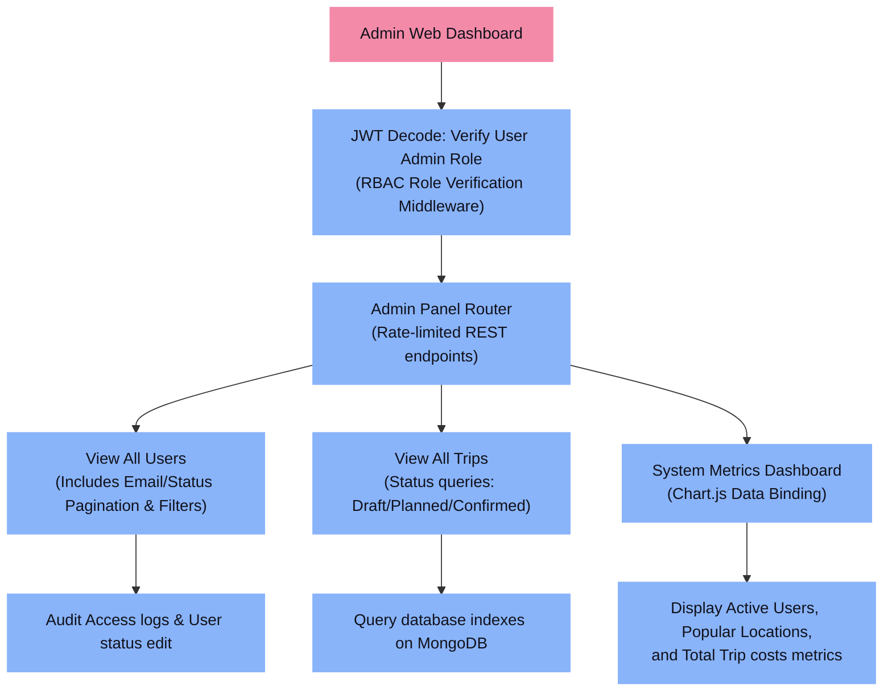
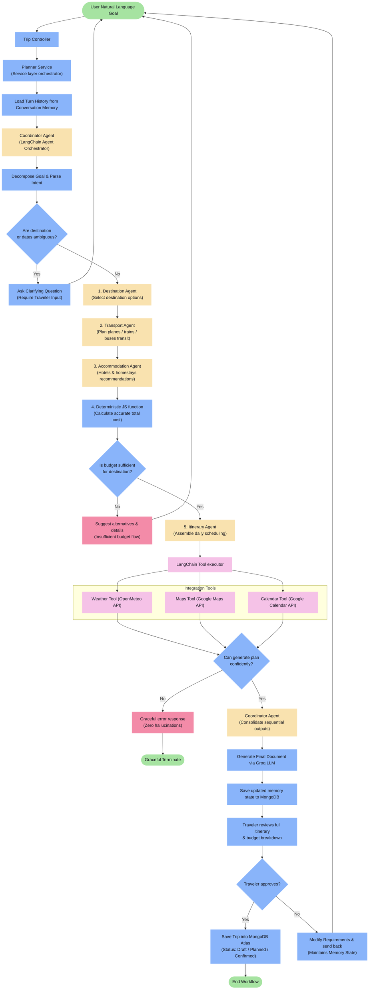
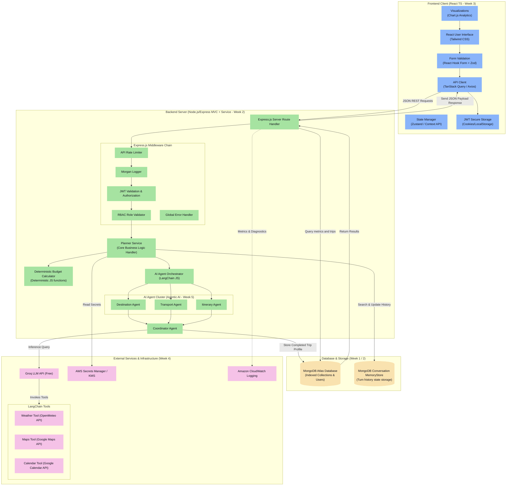

# Travel Planner AI Agent - Capstone Project Documentation

This repository contains the architecture, workflow designs, and system integration details for the Travel Planner AI Client/Server application. The project serves as a comprehensive capstone integrating the architectural principles and technologies studied from **Week 1 through Week 5**.

---

## MAP: Applied Curriculum Topics
* **Week 1 (Foundations & DSA)**: MongoDB Indexing configuration (`userId`, `tripId`, `status`), schema validations, and Git Branching strategies.
* **Week 2 (Backend)**: Express.js REST application styled as **MVC structure with Planner Services**, global rates throttling, Morgan logs, JWT validation, and RBAC auth.
* **Week 3 (Frontend)**: React Single Page Application utilizing Vite, Zustand state, **React Hook Form + Zod input verification**, caching via **TanStack Query**, and **Chart.js** data visualizations.
* **Week 4 (DevOps)**: GitHub Actions test loops, Docker container packaging, and infra automation using **Terraform on AWS (EC2 / S3 / CloudFront / Security Groups)**.
* **Week 5 (Agentic AI)**: Multi-agent coordination (Destination, Transport, and Itinerary agents) run by an orchestrating **Coordinator Agent** using **Groq LLM API**, featuring LangChain Tool integrations, deterministic calculations, and session state memory.

---

## 1. Traveler Workflow

Traces the execution path starting from client-side Zod form validation, JWT validation, service orchestration, external API tool calling, and human-in-the-loop validation, down to MongoDB persistence.

```mermaid
graph TD
    %% Styling and config
    classDef default fill:#1e1e2e,stroke:#cdd6f4,stroke-width:2px,color:#cdd6f4;
    classDef startEnd fill:#a6e3a1,stroke:#a6e3a1,stroke-width:2px,color:#11111b;
    classDef process fill:#89b4fa,stroke:#89b4fa,stroke-width:2px,color:#11111b;
    classDef agent fill:#f9e2af,stroke:#f9e2af,stroke-width:2px,color:#11111b;
    classDef api fill:#f5c2e7,stroke:#f5c2e7,stroke-width:2px,color:#11111b;
    
    Traveler([Traveler]):::startEnd --> ClientInput["Dashboard Input Form<br/>(Client Validation: Hook Form + Zod)"]:::process
    ClientInput --> Auth["User Registration / Login<br/>JWT/RBAC Auth Middleware"]:::process
    Auth --> FetchData["Fetch User Dashboard Data<br/>(TanStack Query caching, API Pagination & Filters)"]:::process
    
    FetchData --> Create["Create New Trip Request"]:::process
    FetchData --> View["View Existing Trips / Delete Trip"]:::process
    
    Create --> InputGoal["User enters Goal Input<br/>e.g., 'Plan a 5-day trip to Manali for 2 people within ₹30,000'"]:::process
    View --> InputGoal
    
    InputGoal --> ExpressRouter["Express.js Server Router<br/>Rate-limiting via express-rate-limit<br/>Morgan/Winston Session Logging"]:::process
    
    ExpressRouter --> PlannerService["Planner Service Layer<br/>(Separates controller from AI orchestration)"]:::process
    PlannerService --> FetchMem["Load Turn History from Conversation Memory"]:::process
    
    FetchMem --> Orchestrator["Coordinator Agent<br/>(LangChain Executor with Memory context)"]:::agent
    Orchestrator --> ParseIntent["Understand User Intent & Requirements"]:::process
    ParseIntent --> SplitTasks["Break Input into Sub-Tasks"]:::process
    
    SplitTasks --> DestAgent["Destination Agent<br/>Select ideal location options"]:::agent
    SplitTasks --> TransAgent["Transport Agent<br/>Plan transit connections"]:::agent
    SplitTasks --> AccomAgent["Accommodation Agent<br/>Search hotels & homestays"]:::agent
    
    DestAgent --> BudgetJS["Deterministic JS Budget Function<br/>(Math calculation & limit validation)"]:::process
    TransAgent --> BudgetJS
    AccomAgent --> BudgetJS
    
    BudgetJS --> ItinAgent["Itinerary Agent<br/>Assemble scheduling sequence"]:::agent
    
    ItinAgent --> Coordinator["Coordinator Agent<br/>Reconsolidates Context"]:::agent
    
    Coordinator --> ToolCall["Execute Agent Tools<br/>Weather & Maps API calls"]:::api
    
    ToolCall --> GenPlan["Generate Final Travel Plan via Groq API (Free)<br/>(Async/Await processing)"]:::process
    GenPlan --> HITL{"Human-in-the-Loop Confirmation<br/>'Do you approve this travel plan?'"}:::process
    
    HITL -->|Approve| SaveDB["Save Trip to MongoDB Atlas<br/>(Mongoose write validations)"]:::process
    HITL -->|Reject| ModifyReq["Modify Requirements & Send Back"]:::process
    
    SaveDB --> ScheduleRem["Schedule Reminders (Calendar Tool Integration)"]:::process
    ModifyReq --> Orchestrator
    
    ScheduleRem --> UpdateStatus["Update Trip Status<br/>(Draft ➔ Planned ➔ Confirmed)"]:::process
    UpdateStatus --> DashboardUpdate([User Dashboard UI Updated]):::startEnd
```

---

## 2. Admin Workflow

Details admin authorization, role validation middleware, navigation to administrative management sections, and metrics visualization dashboards. Admin features fetch directly from database indexes without hitting AI.

---

## 3. AI Agent Internal Flow

Highlights sequential planning execution and conditional routing (handling ambiguity, budget checks, confidence failures, tool calling, and human validation) to complete traveler goals.

---

## 4. Project Development Workflow

Illustrates the Git workflow, Continuous Integration pipeline via GitHub Actions, Docker builds, Terraform IaC provisioning, and deployment endpoints on AWS.

---

## 5. Complete System Architecture

Maps out the structural tier boundaries: Frontend Web Client, Service Layer context, AI Agent orchestration cluster, External Integrations, and persistent database layers.

